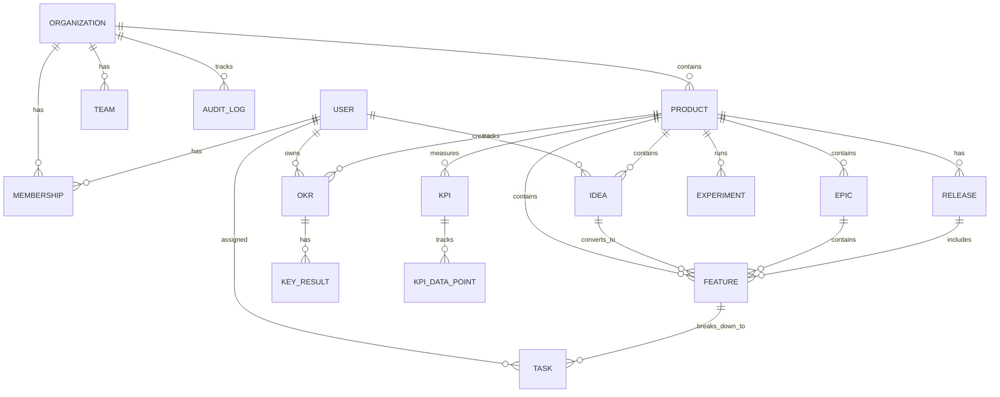

# ProdMatic Database Schema Documentation

This document provides comprehensive documentation for the ProdMatic database schema, including all models, relationships, and data patterns.

## Table of Contents

1. [Overview](#overview)
2. [Core Models](#core-models)
3. [Authentication Models](#authentication-models)
4. [Product Management Models](#product-management-models)
5. [Collaboration Models](#collaboration-models)
6. [Analytics Models](#analytics-models)
7. [Integration Models](#integration-models)
8. [Relationships](#relationships)
9. [Indexes and Performance](#indexes-and-performance)
10. [Data Migration Patterns](#data-migration-patterns)

## Overview

ProdMatic uses PostgreSQL with Prisma ORM for type-safe database operations. The schema supports:

- **Multi-tenancy**: Organization-based data isolation
- **Product Lifecycle**: Complete product management workflow
- **Role-based Access**: Granular permission system
- **Audit Logging**: Complete activity tracking
- **Soft Deletion**: Data preservation with `deletedAt` fields

### Database Configuration

```prisma
generator client {
  provider = "prisma-client-js"
}

datasource db {
  provider = "postgresql"
  url      = env("DATABASE_URL")
}
```

## Core Models

### Organization

**Purpose**: Top-level tenant entity for multi-tenancy

```prisma
model Organization {
  id          String       @id @default(cuid())
  name        String
  slug        String       @unique
  description String?
  domain      String?
  logo        String?
  website     String?
  settings    Json?        @default("{}")
  createdAt   DateTime     @default(now())
  updatedAt   DateTime     @updatedAt
  deletedAt   DateTime?
  
  // Relations
  auditLogs   AuditLog[]
  invitations Invitation[]
  memberships Membership[]
  products    Product[]
  teams       Team[]
  webhooks    Webhook[]

  @@index([slug])
  @@index([deletedAt])
}
```

**Key Features:**
- Unique slug for URL routing
- JSON settings for flexible configuration
- Soft deletion support
- Domain-based organization identification

**Usage Examples:**
```typescript
// Create organization
const org = await prisma.organization.create({
  data: {
    name: "TechCorp Solutions",
    slug: "techcorp",
    description: "Leading technology solutions provider",
    settings: {
      features: ["analytics", "integrations"],
      branding: { primaryColor: "#3B82F6" }
    }
  }
});

// Find with products
const orgWithProducts = await prisma.organization.findUnique({
  where: { slug: "techcorp" },
  include: {
    products: {
      where: { deletedAt: null },
      orderBy: { createdAt: 'desc' }
    }
  }
});
```

### Product

**Purpose**: Core entity representing a product through its lifecycle

```prisma
model Product {
  id             String         @id @default(cuid())
  name           String
  key            String         @unique
  description    String?
  vision         String?
  lifecycle      Lifecycle      @default(IDEATION)
  organizationId String
  settings       Json?          @default("{}")
  metrics        Json?          @default("{}")
  createdAt      DateTime       @default(now())
  updatedAt      DateTime       @updatedAt
  deletedAt      DateTime?
  
  // Relations
  organization   Organization   @relation(fields: [organizationId], references: [id], onDelete: Cascade)
  ideas          Idea[]
  features       Feature[]
  releases       Release[]
  okrs           OKR[]
  // ... many more relations

  @@index([key])
  @@index([organizationId])
  @@index([lifecycle])
  @@index([deletedAt])
}

enum Lifecycle {
  IDEATION
  DISCOVERY
  DEFINITION
  DELIVERY
  LAUNCH
  GROWTH
  MATURITY
  SUNSET
}
```

**Lifecycle Stages:**
- `IDEATION`: Initial concept and idea validation
- `DISCOVERY`: Market research and user interviews
- `DEFINITION`: Requirements and specifications
- `DELIVERY`: Development and implementation
- `LAUNCH`: Go-to-market and release
- `GROWTH`: Scaling and optimization
- `MATURITY`: Maintenance and incremental improvements
- `SUNSET`: End-of-life planning and migration

### Team

**Purpose**: Organizational units within companies

```prisma
model Team {
  id             String       @id @default(cuid())
  name           String
  slug           String
  description    String?
  organizationId String
  createdAt      DateTime     @default(now())
  updatedAt      DateTime     @updatedAt
  deletedAt      DateTime?
  
  // Relations
  organization   Organization @relation(fields: [organizationId], references: [id], onDelete: Cascade)
  members        Membership[]
  products       Product[]    @relation("ProductToTeam")

  @@unique([organizationId, slug])
  @@index([organizationId])
  @@index([deletedAt])
}
```

## Authentication Models

### User

**Purpose**: User accounts with authentication and profile data

```prisma
model User {
  id             String                @id @default(cuid())
  name           String?
  email          String                @unique
  emailVerified  DateTime?
  image          String?
  password       String?
  createdAt      DateTime              @default(now())
  updatedAt      DateTime              @updatedAt
  
  // Relations
  accounts       Account[]
  sessions       Session[]
  memberships    Membership[]
  profile        UserProfile?
  // Activity relations
  createdIdeas   Idea[]                @relation("IdeaCreator")
  ownedOKRs      OKR[]                 @relation("OKROwner")
  assignedTasks  Task[]                @relation("TaskAssignee")
  auditLogs      AuditLog[]

  @@index([email])
}

model UserProfile {
  id       String  @id @default(cuid())
  userId   String  @unique
  bio      String?
  title    String?
  timezone String?
  locale   String? @default("en")
  
  user     User    @relation(fields: [userId], references: [id], onDelete: Cascade)
}
```

### Membership

**Purpose**: User roles within organizations and teams

```prisma
model Membership {
  id             String       @id @default(cuid())
  userId         String
  organizationId String
  teamId         String?
  role           Role         @default(STAKEHOLDER)
  createdAt      DateTime     @default(now())
  updatedAt      DateTime     @updatedAt
  
  // Relations
  user           User         @relation(fields: [userId], references: [id], onDelete: Cascade)
  organization   Organization @relation(fields: [organizationId], references: [id], onDelete: Cascade)
  team           Team?        @relation(fields: [teamId], references: [id])

  @@unique([userId, organizationId])
  @@index([organizationId])
  @@index([teamId])
}

enum Role {
  ADMIN
  PRODUCT_MANAGER
  DEVELOPER
  DESIGNER
  STAKEHOLDER
}
```

**Role Permissions:**
- `ADMIN`: Full organization access
- `PRODUCT_MANAGER`: Product lifecycle management
- `DEVELOPER`: Development tasks and features
- `DESIGNER`: Design and user experience
- `STAKEHOLDER`: Read-only access and feedback

### NextAuth Models

```prisma
model Account {
  id                String  @id @default(cuid())
  userId            String
  type              String
  provider          String
  providerAccountId String
  refresh_token     String?
  access_token      String?
  expires_at        Int?
  token_type        String?
  scope             String?
  id_token          String?
  session_state     String?
  
  user              User    @relation(fields: [userId], references: [id], onDelete: Cascade)

  @@unique([provider, providerAccountId])
}

model Session {
  id           String   @id @default(cuid())
  sessionToken String   @unique
  userId       String
  expires      DateTime
  
  user         User     @relation(fields: [userId], references: [id], onDelete: Cascade)
}
```

## Product Management Models

### Idea

**Purpose**: Product ideas that can be scored and converted to features

```prisma
model Idea {
  id          String      @id @default(cuid())
  title       String
  description String
  productId   String
  creatorId   String
  status      IdeaStatus  @default(SUBMITTED)
  priority    Int?        @default(0)
  effort      Int?        @default(1)
  impact      Int?        @default(1)
  confidence  Int?        @default(1)
  riceScore   Float?      @default(0)
  iceScore    Float?      @default(0)
  wsjfScore   Float?      @default(0)
  tags        String[]    @default([])
  createdAt   DateTime    @default(now())
  updatedAt   DateTime    @updatedAt
  deletedAt   DateTime?
  
  // Relations
  product     Product     @relation(fields: [productId], references: [id], onDelete: Cascade)
  creator     User        @relation("IdeaCreator", fields: [creatorId], references: [id])
  features    Feature[]   @relation("IdeaToFeature")

  @@index([productId])
  @@index([creatorId])
  @@index([status])
  @@index([priority])
}

enum IdeaStatus {
  SUBMITTED
  UNDER_REVIEW
  APPROVED
  IN_DEVELOPMENT
  IMPLEMENTED
  REJECTED
}
```

**Scoring Algorithms:**
```typescript
// RICE Score: Reach × Impact × Confidence ÷ Effort
riceScore = (reach * impact * confidence) / effort

// ICE Score: Impact × Confidence × Ease
iceScore = impact * confidence * (10 - effort + 1)

// WSJF Score: (Business Value + Time Criticality + Risk Reduction) ÷ Job Size
wsjfScore = (businessValue + timeCriticality + riskReduction) / jobSize
```

### Feature

**Purpose**: Implemented product capabilities

```prisma
model Feature {
  id            String        @id @default(cuid())
  title         String
  description   String
  productId     String
  epicId        String?
  status        FeatureStatus @default(BACKLOG)
  priority      Priority      @default(MEDIUM)
  storyPoints   Int?
  acceptanceCriteria String?
  createdAt     DateTime      @default(now())
  updatedAt     DateTime      @updatedAt
  deletedAt     DateTime?
  
  // Relations
  product       Product       @relation(fields: [productId], references: [id], onDelete: Cascade)
  epic          Epic?         @relation(fields: [epicId], references: [id])
  ideas         Idea[]        @relation("IdeaToFeature")
  tasks         Task[]
  releases      Release[]     @relation("FeatureToRelease")

  @@index([productId])
  @@index([epicId])
  @@index([status])
  @@index([priority])
}

enum FeatureStatus {
  BACKLOG
  IN_PROGRESS
  IN_REVIEW
  TESTING
  DONE
  CANCELLED
}

enum Priority {
  CRITICAL
  HIGH
  MEDIUM
  LOW
}
```

### Epic

**Purpose**: Large features broken down into smaller features

```prisma
model Epic {
  id          String     @id @default(cuid())
  title       String
  description String
  productId   String
  status      EpicStatus @default(PLANNING)
  startDate   DateTime?
  endDate     DateTime?
  createdAt   DateTime   @default(now())
  updatedAt   DateTime   @updatedAt
  deletedAt   DateTime?
  
  // Relations
  product     Product    @relation(fields: [productId], references: [id], onDelete: Cascade)
  features    Feature[]

  @@index([productId])
  @@index([status])
}

enum EpicStatus {
  PLANNING
  IN_PROGRESS
  COMPLETED
  CANCELLED
}
```

### Release

**Purpose**: Product releases with changelogs and features

```prisma
model Release {
  id          String        @id @default(cuid())
  name        String
  version     String
  productId   String
  description String?
  status      ReleaseStatus @default(PLANNING)
  type        ReleaseType   @default(MINOR)
  targetDate  DateTime?
  releaseDate DateTime?
  createdAt   DateTime      @default(now())
  updatedAt   DateTime      @updatedAt
  deletedAt   DateTime?
  
  // Relations
  product     Product       @relation(fields: [productId], references: [id], onDelete: Cascade)
  features    Feature[]     @relation("FeatureToRelease")
  changelogs  Changelog[]
  checklist   LaunchChecklistItem[]

  @@index([productId])
  @@index([status])
  @@index([targetDate])
}

enum ReleaseStatus {
  PLANNING
  IN_PROGRESS
  TESTING
  READY
  RELEASED
  CANCELLED
}

enum ReleaseType {
  MAJOR
  MINOR
  PATCH
  HOTFIX
}
```

### OKR (Objectives and Key Results)

**Purpose**: Goal tracking and measurement

```prisma
model OKR {
  id          String      @id @default(cuid())
  title       String
  description String?
  productId   String
  ownerId     String
  quarter     String
  status      OKRStatus   @default(DRAFT)
  progress    Float       @default(0)
  createdAt   DateTime    @default(now())
  updatedAt   DateTime    @updatedAt
  deletedAt   DateTime?
  
  // Relations
  product     Product     @relation(fields: [productId], references: [id], onDelete: Cascade)
  owner       User        @relation("OKROwner", fields: [ownerId], references: [id])
  keyResults  KeyResult[]

  @@index([productId])
  @@index([ownerId])
  @@index([quarter])
  @@index([status])
}

model KeyResult {
  id           String    @id @default(cuid())
  okrId        String
  title        String
  description  String?
  targetValue  Float
  currentValue Float     @default(0)
  unit         String
  createdAt    DateTime  @default(now())
  updatedAt    DateTime  @updatedAt
  
  // Relations
  okr          OKR       @relation(fields: [okrId], references: [id], onDelete: Cascade)

  @@index([okrId])
}

enum OKRStatus {
  DRAFT
  ACTIVE
  COMPLETED
  CANCELLED
}
```

## Collaboration Models

### Document

**Purpose**: Product documentation (PRDs, RFCs, specs)

```prisma
model Document {
  id             String       @id @default(cuid())
  title          String
  content        String
  type           DocumentType @default(GENERAL)
  status         DocumentStatus @default(DRAFT)
  version        Int          @default(1)
  productId      String?
  organizationId String
  authorId       String
  createdAt      DateTime     @default(now())
  updatedAt      DateTime     @updatedAt
  deletedAt      DateTime?
  
  // Relations
  product        Product?     @relation(fields: [productId], references: [id])
  organization   Organization @relation(fields: [organizationId], references: [id], onDelete: Cascade)
  author         User         @relation("DocumentAuthor", fields: [authorId], references: [id])

  @@index([productId])
  @@index([organizationId])
  @@index([authorId])
  @@index([type])
  @@index([status])
}

enum DocumentType {
  PRD
  RFC
  SPEC
  GUIDE
  POLICY
  GENERAL
}

enum DocumentStatus {
  DRAFT
  REVIEW
  APPROVED
  PUBLISHED
  ARCHIVED
}
```

### Task

**Purpose**: Work items and action items

```prisma
model Task {
  id          String     @id @default(cuid())
  title       String
  description String?
  productId   String
  featureId   String?
  assigneeId  String?
  status      TaskStatus @default(TODO)
  priority    Priority   @default(MEDIUM)
  dueDate     DateTime?
  createdAt   DateTime   @default(now())
  updatedAt   DateTime   @updatedAt
  deletedAt   DateTime?
  
  // Relations
  product     Product    @relation(fields: [productId], references: [id], onDelete: Cascade)
  feature     Feature?   @relation(fields: [featureId], references: [id])
  assignee    User?      @relation("TaskAssignee", fields: [assigneeId], references: [id])

  @@index([productId])
  @@index([featureId])
  @@index([assigneeId])
  @@index([status])
  @@index([dueDate])
}

enum TaskStatus {
  TODO
  IN_PROGRESS
  IN_REVIEW
  DONE
  CANCELLED
}
```

## Analytics Models

### KPI (Key Performance Indicator)

**Purpose**: Product metrics and performance tracking

```prisma
model KPI {
  id          String    @id @default(cuid())
  name        String
  description String?
  productId   String
  ownerId     String
  targetValue Float
  currentValue Float    @default(0)
  unit        String
  frequency   Frequency @default(MONTHLY)
  createdAt   DateTime  @default(now())
  updatedAt   DateTime  @updatedAt
  deletedAt   DateTime?
  
  // Relations
  product     Product   @relation(fields: [productId], references: [id], onDelete: Cascade)
  owner       User      @relation("KPIOwner", fields: [ownerId], references: [id])
  dataPoints  KPIDataPoint[]

  @@index([productId])
  @@index([ownerId])
  @@index([frequency])
}

model KPIDataPoint {
  id        String   @id @default(cuid())
  kpiId     String
  value     Float
  date      DateTime
  createdAt DateTime @default(now())
  
  // Relations
  kpi       KPI      @relation(fields: [kpiId], references: [id], onDelete: Cascade)

  @@index([kpiId])
  @@index([date])
}

enum Frequency {
  DAILY
  WEEKLY
  MONTHLY
  QUARTERLY
}
```

### Experiment

**Purpose**: A/B tests and feature experiments

```prisma
model Experiment {
  id          String           @id @default(cuid())
  name        String
  description String?
  hypothesis  String
  productId   String
  ownerId     String
  status      ExperimentStatus @default(DRAFT)
  startDate   DateTime?
  endDate     DateTime?
  metrics     String[]         @default([])
  results     Json?
  createdAt   DateTime         @default(now())
  updatedAt   DateTime         @updatedAt
  deletedAt   DateTime?
  
  // Relations
  product     Product          @relation(fields: [productId], references: [id], onDelete: Cascade)
  owner       User             @relation("ExperimentOwner", fields: [ownerId], references: [id])

  @@index([productId])
  @@index([ownerId])
  @@index([status])
  @@index([startDate])
}

enum ExperimentStatus {
  DRAFT
  RUNNING
  COMPLETED
  CANCELLED
}
```

### Feedback

**Purpose**: User feedback and feature requests

```prisma
model Feedback {
  id          String         @id @default(cuid())
  title       String
  description String
  productId   String
  type        FeedbackType   @default(FEATURE_REQUEST)
  status      FeedbackStatus @default(SUBMITTED)
  priority    Priority       @default(MEDIUM)
  source      String?        // e.g., "support", "survey", "interview"
  userEmail   String?
  createdAt   DateTime       @default(now())
  updatedAt   DateTime       @updatedAt
  deletedAt   DateTime?
  
  // Relations
  product     Product        @relation(fields: [productId], references: [id], onDelete: Cascade)

  @@index([productId])
  @@index([type])
  @@index([status])
  @@index([priority])
}

enum FeedbackType {
  FEATURE_REQUEST
  BUG_REPORT
  IMPROVEMENT
  COMPLAINT
  COMPLIMENT
}

enum FeedbackStatus {
  SUBMITTED
  UNDER_REVIEW
  PLANNED
  IN_PROGRESS
  COMPLETED
  REJECTED
}
```

## Integration Models

### Webhook

**Purpose**: External service integrations

```prisma
model Webhook {
  id             String        @id @default(cuid())
  name           String
  url            String
  organizationId String
  events         String[]      @default([])
  secret         String?
  active         Boolean       @default(true)
  createdAt      DateTime      @default(now())
  updatedAt      DateTime      @updatedAt
  
  // Relations
  organization   Organization  @relation(fields: [organizationId], references: [id], onDelete: Cascade)
  deliveries     WebhookDelivery[]

  @@index([organizationId])
  @@index([active])
}

model WebhookDelivery {
  id         String            @id @default(cuid())
  webhookId  String
  event      String
  payload    Json
  status     WebhookStatus     @default(PENDING)
  attempts   Int               @default(0)
  response   String?
  createdAt  DateTime          @default(now())
  
  // Relations
  webhook    Webhook           @relation(fields: [webhookId], references: [id], onDelete: Cascade)

  @@index([webhookId])
  @@index([status])
  @@index([createdAt])
}

enum WebhookStatus {
  PENDING
  SUCCESS
  FAILED
  RETRYING
}
```

### AuditLog

**Purpose**: Activity tracking and compliance

```prisma
model AuditLog {
  id             String       @id @default(cuid())
  action         String
  entityType     String
  entityId       String
  userId         String?
  organizationId String
  metadata       Json?
  ipAddress      String?
  userAgent      String?
  createdAt      DateTime     @default(now())
  
  // Relations
  user           User?        @relation(fields: [userId], references: [id])
  organization   Organization @relation(fields: [organizationId], references: [id], onDelete: Cascade)

  @@index([userId])
  @@index([organizationId])
  @@index([entityType, entityId])
  @@index([action])
  @@index([createdAt])
}
```

## Relationships

### Entity Relationship Diagram



### Key Relationships

1. **Organization → Products**: One-to-many, cascade delete
2. **Product → Ideas**: One-to-many, ideas can convert to features
3. **Epic → Features**: One-to-many, large features broken down
4. **Feature → Tasks**: One-to-many, implementation breakdown
5. **Release → Features**: Many-to-many, features included in releases
6. **User → Memberships**: One-to-many, roles in organizations

### Cascade Deletion Rules

```typescript
// Organization deletion cascades to:
- products
- teams
- memberships
- audit logs
- webhooks

// Product deletion cascades to:
- ideas
- features
- releases
- okrs
- kpis
- experiments

// User deletion cascades to:
- accounts
- sessions
- memberships
```

## Indexes and Performance

### Primary Indexes

```sql
-- Core entity lookups
CREATE INDEX idx_organization_slug ON "Organization"(slug);
CREATE INDEX idx_product_key ON "Product"(key);
CREATE INDEX idx_user_email ON "User"(email);

-- Relationship indexes
CREATE INDEX idx_product_organization ON "Product"("organizationId");
CREATE INDEX idx_membership_user_org ON "Membership"("userId", "organizationId");
CREATE INDEX idx_idea_product ON "Idea"("productId");

-- Status and filtering indexes
CREATE INDEX idx_product_lifecycle ON "Product"(lifecycle);
CREATE INDEX idx_feature_status ON "Feature"(status);
CREATE INDEX idx_release_status ON "Release"(status);

-- Soft deletion indexes
CREATE INDEX idx_organization_deleted ON "Organization"("deletedAt");
CREATE INDEX idx_product_deleted ON "Product"("deletedAt");

-- Audit and activity indexes
CREATE INDEX idx_audit_log_created ON "AuditLog"("createdAt");
CREATE INDEX idx_audit_log_entity ON "AuditLog"("entityType", "entityId");
```

### Query Optimization Patterns

```typescript
// Efficient organization products query
const productsWithCounts = await prisma.product.findMany({
  where: {
    organizationId: orgId,
    deletedAt: null
  },
  include: {
    _count: {
      select: {
        ideas: { where: { deletedAt: null } },
        features: { where: { deletedAt: null } },
        releases: { where: { deletedAt: null } }
      }
    }
  },
  orderBy: { createdAt: 'desc' }
});

// Paginated ideas with scoring
const ideas = await prisma.idea.findMany({
  where: {
    productId,
    deletedAt: null,
    status: { in: ['SUBMITTED', 'UNDER_REVIEW'] }
  },
  include: {
    creator: { select: { name: true, image: true } }
  },
  orderBy: { riceScore: 'desc' },
  skip: (page - 1) * pageSize,
  take: pageSize
});
```

## Data Migration Patterns

### Version Migration Example

```sql
-- Migration: Add lifecycle tracking to products
ALTER TABLE "Product" ADD COLUMN "lifecycle" "Lifecycle" DEFAULT 'IDEATION';

-- Update existing products based on their features
UPDATE "Product" 
SET "lifecycle" = 'DELIVERY'
WHERE id IN (
  SELECT DISTINCT "productId" 
  FROM "Feature" 
  WHERE status IN ('IN_PROGRESS', 'IN_REVIEW')
);

UPDATE "Product" 
SET "lifecycle" = 'LAUNCH'
WHERE id IN (
  SELECT DISTINCT "productId" 
  FROM "Release" 
  WHERE status = 'RELEASED'
);
```

### Data Seeding Patterns

```typescript
// Seed script example
async function seedOrganization() {
  const org = await prisma.organization.create({
    data: {
      name: "Demo Company",
      slug: "demo",
      description: "Demo organization for testing",
      settings: {
        features: ["analytics", "integrations"],
        branding: { primaryColor: "#3B82F6" }
      }
    }
  });

  const product = await prisma.product.create({
    data: {
      name: "Demo Product",
      key: "demo-product",
      description: "A sample product for demonstration",
      organizationId: org.id,
      lifecycle: "DELIVERY"
    }
  });

  // Seed ideas with scoring
  const ideas = await Promise.all([
    prisma.idea.create({
      data: {
        title: "Mobile App",
        description: "Native mobile application",
        productId: product.id,
        creatorId: user.id,
        priority: 90,
        effort: 8,
        impact: 9,
        confidence: 7,
        riceScore: (100 * 9 * 7) / 8 // 787.5
      }
    })
  ]);
}
```

### Backup and Recovery

```bash
# Database backup
pg_dump $DATABASE_URL > backup_$(date +%Y%m%d_%H%M%S).sql

# Restore from backup
psql $DATABASE_URL < backup_20240125_120000.sql

# Prisma schema sync
npx prisma db push
npx prisma generate
```

## Best Practices

### Data Integrity

1. **Use transactions** for multi-table operations
2. **Validate foreign keys** before deletion
3. **Implement soft deletion** for audit trails
4. **Use enums** for status fields
5. **Add constraints** for business rules

### Performance Optimization

1. **Index frequently queried fields**
2. **Use select and include strategically**
3. **Implement pagination** for large datasets
4. **Cache expensive queries**
5. **Monitor query performance**

### Security Considerations

1. **Row-level security** with organization isolation
2. **Input validation** with Zod schemas
3. **Audit logging** for sensitive operations
4. **Encrypted sensitive fields**
5. **Regular security updates**

---

## Support

For database-related questions:
- Schema Documentation: [schema.prodmatic.com](https://schema.prodmatic.com)
- Prisma Docs: [prisma.io/docs](https://prisma.io/docs)
- GitHub Issues: [github.com/prodmatic/prodmatic/issues](https://github.com/prodmatic/prodmatic/issues)
