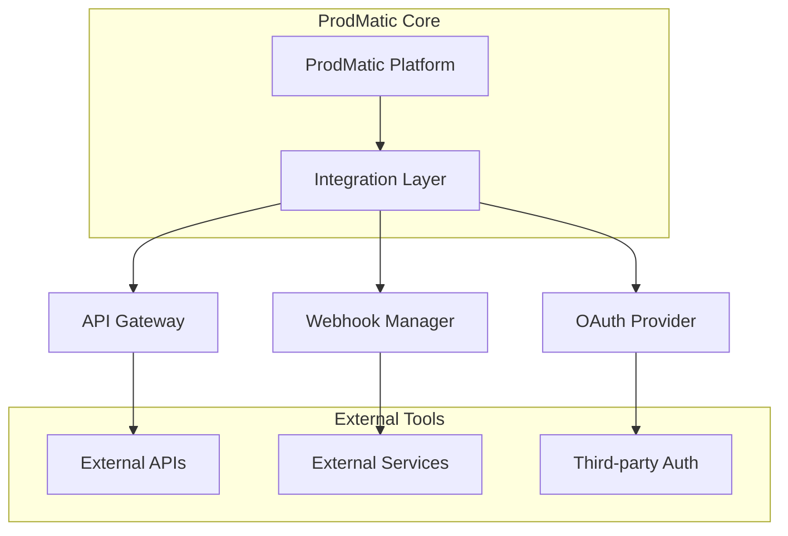

# ProdMatic Integration Guide

This guide provides comprehensive information on integrating ProdMatic with external services, APIs, and tools to enhance your product management workflow.

## Table of Contents

1. [Integration Overview](#integration-overview)
2. [Authentication and Security](#authentication-and-security)
3. [API Integration](#api-integration)
4. [Communication Tools](#communication-tools)
5. [Development Tools](#development-tools)
6. [Analytics and Monitoring](#analytics-and-monitoring)
7. [Design Tools](#design-tools)
8. [Customer Support Tools](#customer-support-tools)
9. [Custom Integrations](#custom-integrations)
10. [Webhooks](#webhooks)
11. [Data Import/Export](#data-importexport)
12. [Troubleshooting](#troubleshooting)
13. [Best Practices](#best-practices)

## Integration Overview

### Supported Integration Types

ProdMatic supports various integration patterns to fit your workflow:

**Real-time Integrations**:
- Webhook-based notifications
- API polling for status updates
- Live data synchronization
- Event-driven workflows

**Batch Integrations**:
- Scheduled data imports
- Bulk data exports
- Periodic synchronization
- Report generation

**Authentication Methods**:
- OAuth 2.0 (recommended)
- API Keys
- JWT tokens
- Basic authentication (legacy)

### Integration Architecture



## Authentication and Security

### OAuth 2.0 Setup

Most integrations use OAuth 2.0 for secure authentication:

**Step 1: Register Application**
1. Go to the external service's developer console
2. Create a new application/integration
3. Configure redirect URIs:
   ```
   https://your-org.prodmatic.com/api/integrations/callback
   ```
4. Note the Client ID and Client Secret

**Step 2: Configure in ProdMatic**
1. Navigate to Organization Settings > Integrations
2. Select the service you want to integrate
3. Enter Client ID and Client Secret
4. Configure scopes and permissions
5. Test the connection

**Step 3: Authorize Access**
1. Click "Connect" for the integration
2. You'll be redirected to the external service
3. Grant necessary permissions
4. Return to ProdMatic to complete setup

### API Key Management

For services that use API keys:

**Secure Storage**:
- API keys are encrypted at rest
- Keys are never logged or exposed in URLs
- Regular key rotation is recommended
- Access is logged for audit purposes

**Key Configuration**:
```json
{
  "service": "example-service",
  "apiKey": "your-api-key",
  "environment": "production",
  "scopes": ["read", "write"],
  "rateLimit": {
    "requests": 1000,
    "period": "hour"
  }
}
```

### Security Best Practices

1. **Principle of Least Privilege**: Grant minimum necessary permissions
2. **Regular Audits**: Review integration permissions quarterly
3. **Key Rotation**: Rotate API keys every 90 days
4. **Monitor Usage**: Track API usage and unusual patterns
5. **Secure Networks**: Use HTTPS for all communications

## API Integration

### ProdMatic REST API

ProdMatic provides a comprehensive REST API for external integrations:

**Base URL**: `https://api.prodmatic.com/v1`

**Authentication Header**:
```http
Authorization: Bearer YOUR_API_TOKEN
Content-Type: application/json
```

### Core API Endpoints

**Organizations**:
```http
GET    /organizations
GET    /organizations/{orgId}
POST   /organizations
PUT    /organizations/{orgId}
DELETE /organizations/{orgId}
```

**Products**:
```http
GET    /organizations/{orgId}/products
GET    /organizations/{orgId}/products/{productId}
POST   /organizations/{orgId}/products
PUT    /organizations/{orgId}/products/{productId}
DELETE /organizations/{orgId}/products/{productId}
```

**Ideas**:
```http
GET    /organizations/{orgId}/products/{productId}/ideas
POST   /organizations/{orgId}/products/{productId}/ideas
PUT    /organizations/{orgId}/products/{productId}/ideas/{ideaId}
DELETE /organizations/{orgId}/products/{productId}/ideas/{ideaId}
```

**Features**:
```http
GET    /organizations/{orgId}/products/{productId}/features
POST   /organizations/{orgId}/products/{productId}/features
PUT    /organizations/{orgId}/products/{productId}/features/{featureId}
DELETE /organizations/{orgId}/products/{productId}/features/{featureId}
```

### API Usage Examples

**Create a New Idea**:
```javascript
const response = await fetch('https://api.prodmatic.com/v1/organizations/org123/products/prod456/ideas', {
  method: 'POST',
  headers: {
    'Authorization': 'Bearer YOUR_API_TOKEN',
    'Content-Type': 'application/json'
  },
  body: JSON.stringify({
    title: 'Mobile App Dark Mode',
    description: 'Add dark mode support to improve user experience',
    impact: 8,
    effort: 5,
    confidence: 9,
    reach: 1000,
    tags: ['ui', 'mobile', 'accessibility']
  })
});

const idea = await response.json();
console.log('Created idea:', idea.id);
```

**Update Feature Status**:
```python
import requests

url = 'https://api.prodmatic.com/v1/organizations/org123/products/prod456/features/feat789'
headers = {
    'Authorization': 'Bearer YOUR_API_TOKEN',
    'Content-Type': 'application/json'
}
data = {
    'status': 'IN_PROGRESS',
    'assigneeId': 'user123',
    'notes': 'Started development, estimated completion in 2 weeks'
}

response = requests.put(url, headers=headers, json=data)
if response.status_code == 200:
    print('Feature updated successfully')
else:
    print(f'Error: {response.status_code} - {response.text}')
```

**Fetch KPI Data**:
```bash
curl -X GET \
  'https://api.prodmatic.com/v1/organizations/org123/products/prod456/kpis?startDate=2024-01-01&endDate=2024-01-31' \
  -H 'Authorization: Bearer YOUR_API_TOKEN' \
  -H 'Content-Type: application/json'
```

### Rate Limiting

API requests are rate-limited to ensure fair usage:

**Rate Limits**:
- **Free Plan**: 100 requests/hour
- **Pro Plan**: 1,000 requests/hour
- **Enterprise Plan**: 10,000 requests/hour

**Rate Limit Headers**:
```http
X-RateLimit-Limit: 1000
X-RateLimit-Remaining: 999
X-RateLimit-Reset: 1640995200
```

**Handling Rate Limits**:
```javascript
const makeAPIRequest = async (url, options) => {
  const response = await fetch(url, options);
  
  if (response.status === 429) {
    const resetTime = response.headers.get('X-RateLimit-Reset');
    const waitTime = (resetTime * 1000) - Date.now();
    
    console.log(`Rate limited. Waiting ${waitTime}ms`);
    await new Promise(resolve => setTimeout(resolve, waitTime));
    
    return makeAPIRequest(url, options); // Retry
  }
  
  return response;
};
```

## Communication Tools

### Slack Integration

**Setup Process**:
1. Go to Organization Settings > Integrations
2. Click "Connect" next to Slack
3. Authorize ProdMatic in your Slack workspace
4. Configure notification channels
5. Set up bot commands (optional)

**Notification Configuration**:
```json
{
  "channels": {
    "#product-updates": {
      "events": ["feature_completed", "release_deployed"],
      "products": ["mobile-app", "web-platform"]
    },
    "#dev-team": {
      "events": ["feature_assigned", "bug_reported"],
      "products": ["all"]
    }
  },
  "messageFormat": "detailed",
  "mentionUsers": true
}
```

**Bot Commands**:
- `/prodmatic status [product]` - Get product status
- `/prodmatic ideas [product]` - List recent ideas
- `/prodmatic create idea [title]` - Create new idea
- `/prodmatic releases [product]` - Show upcoming releases

**Custom Slack App**:
For advanced integrations, create a custom Slack app:

```javascript
const { WebClient } = require('@slack/web-api');
const slack = new WebClient(process.env.SLACK_BOT_TOKEN);

// Send custom notification
const sendReleaseNotification = async (release) => {
  await slack.chat.postMessage({
    channel: '#product-updates',
    blocks: [
      {
        type: 'section',
        text: {
          type: 'mrkdwn',
          text: `🚀 *${release.name}* has been released!`
        }
      },
      {
        type: 'section',
        fields: [
          {
            type: 'mrkdwn',
            text: `*Version:*\n${release.version}`
          },
          {
            type: 'mrkdwn',
            text: `*Features:*\n${release.features.length} new features`
          }
        ]
      }
    ]
  });
};
```

### Microsoft Teams Integration

**Setup Process**:
1. Install ProdMatic app from Teams App Store
2. Configure in Organization Settings > Integrations
3. Authorize necessary permissions
4. Set up channel notifications

**Adaptive Cards**:
ProdMatic sends rich notifications using Adaptive Cards:

```json
{
  "type": "AdaptiveCard",
  "version": "1.3",
  "body": [
    {
      "type": "TextBlock",
      "text": "Feature Completed",
      "weight": "Bolder",
      "size": "Medium"
    },
    {
      "type": "FactSet",
      "facts": [
        {
          "title": "Feature:",
          "value": "User Authentication"
        },
        {
          "title": "Product:",
          "value": "Mobile App"
        },
        {
          "title": "Assignee:",
          "value": "John Doe"
        }
      ]
    }
  ],
  "actions": [
    {
      "type": "Action.OpenUrl",
      "title": "View Feature",
      "url": "https://app.prodmatic.com/features/123"
    }
  ]
}
```

### Discord Integration

**Webhook Setup**:
1. Create webhook in Discord channel settings
2. Copy webhook URL
3. Add to ProdMatic integration settings
4. Configure notification events

**Custom Bot Integration**:
```javascript
const { Client, GatewayIntentBits } = require('discord.js');
const client = new Client({ intents: [GatewayIntentBits.Guilds] });

client.on('ready', () => {
  console.log(`Logged in as ${client.user.tag}!`);
});

// Handle slash commands
client.on('interactionCreate', async interaction => {
  if (!interaction.isChatInputCommand()) return;

  if (interaction.commandName === 'prodmatic') {
    const subcommand = interaction.options.getSubcommand();
    
    if (subcommand === 'status') {
      const product = interaction.options.getString('product');
      const status = await fetchProductStatus(product);
      
      await interaction.reply({
        embeds: [{
          title: `${product} Status`,
          description: status.description,
          color: 0x00ff00,
          fields: [
            {
              name: 'Lifecycle Stage',
              value: status.stage,
              inline: true
            },
            {
              name: 'Active Features',
              value: status.activeFeatures.toString(),
              inline: true
            }
          ]
        }]
      });
    }
  }
});
```

## Development Tools

### GitHub Integration

**Repository Connection**:
1. Go to Product Settings > Integrations
2. Connect GitHub repository
3. Install ProdMatic GitHub App
4. Configure webhook events
5. Map branches to environments

**Automatic Linking**:
Link commits and PRs to features using commit messages:

```bash
# Link commit to feature
git commit -m "Add user authentication [FEAT-123]"

# Link PR to multiple features
git commit -m "Implement dashboard widgets [FEAT-456] [FEAT-789]"

# Close feature with commit
git commit -m "Complete user profile page [FEAT-101] [CLOSES]"
```

**GitHub Actions Integration**:
```yaml
name: ProdMatic Integration

on:
  push:
    branches: [main, develop]
  pull_request:
    branches: [main]

jobs:
  update-prodmatic:
    runs-on: ubuntu-latest
    steps:
      - uses: actions/checkout@v3
      
      - name: Update Feature Status
        uses: prodmatic/github-action@v1
        with:
          api-token: ${{ secrets.PRODMATIC_API_TOKEN }}
          organization-id: ${{ secrets.PRODMATIC_ORG_ID }}
          product-id: ${{ secrets.PRODMATIC_PRODUCT_ID }}
          event-type: 'deployment'
          environment: ${{ github.ref == 'refs/heads/main' && 'production' || 'staging' }}
```

**Status Checks**:
ProdMatic can provide status checks for PRs:

```javascript
// Webhook handler for PR events
app.post('/webhook/github', async (req, res) => {
  const { action, pull_request } = req.body;
  
  if (action === 'opened' || action === 'synchronize') {
    const features = extractFeatureIds(pull_request.title, pull_request.body);
    
    for (const featureId of features) {
      const feature = await getFeature(featureId);
      
      if (feature && feature.status !== 'IN_PROGRESS') {
        await createStatusCheck(pull_request, {
          state: 'failure',
          description: `Feature ${featureId} is not in progress`,
          context: 'prodmatic/feature-status'
        });
      }
    }
  }
  
  res.status(200).send('OK');
});
```

### GitLab Integration

**Project Connection**:
1. Generate GitLab access token
2. Add token to ProdMatic integration settings
3. Configure project webhooks
4. Set up CI/CD pipeline integration

**Pipeline Status Updates**:
```yaml
# .gitlab-ci.yml
stages:
  - test
  - build
  - deploy
  - notify

notify_prodmatic:
  stage: notify
  script:
    - |
      curl -X POST "https://api.prodmatic.com/v1/webhooks/gitlab" \
        -H "Authorization: Bearer $PRODMATIC_API_TOKEN" \
        -H "Content-Type: application/json" \
        -d '{
          "event": "pipeline_success",
          "project_id": "'$CI_PROJECT_ID'",
          "pipeline_id": "'$CI_PIPELINE_ID'",
          "commit_sha": "'$CI_COMMIT_SHA'",
          "branch": "'$CI_COMMIT_REF_NAME'"
        }'
  only:
    - main
    - develop
```

### Jira Integration

**Connection Setup**:
1. Create Jira API token
2. Configure Jira base URL and credentials
3. Map Jira projects to ProdMatic products
4. Set up field mappings

**Bidirectional Sync**:
```javascript
// Sync ProdMatic feature to Jira issue
const syncFeatureToJira = async (feature) => {
  const jiraIssue = {
    fields: {
      project: { key: 'PROJ' },
      summary: feature.title,
      description: feature.description,
      issuetype: { name: 'Story' },
      priority: { name: mapPriorityToJira(feature.priority) },
      assignee: { accountId: feature.assigneeId },
      customfield_10001: feature.storyPoints, // Story Points
      labels: feature.tags
    }
  };
  
  const response = await jira.issues.createIssue(jiraIssue);
  
  // Update ProdMatic feature with Jira issue key
  await updateFeature(feature.id, {
    externalId: response.key,
    externalUrl: `${jiraBaseUrl}/browse/${response.key}`
  });
};

// Handle Jira webhook
app.post('/webhook/jira', async (req, res) => {
  const { issue, changelog } = req.body;
  
  if (changelog) {
    for (const change of changelog.items) {
      if (change.field === 'status') {
        const feature = await findFeatureByExternalId(issue.key);
        if (feature) {
          const newStatus = mapJiraStatusToProdMatic(change.toString);
          await updateFeatureStatus(feature.id, newStatus);
        }
      }
    }
  }
  
  res.status(200).send('OK');
});
```

### Linear Integration

**API Setup**:
1. Generate Linear API key
2. Configure team and project mappings
3. Set up webhook endpoints
4. Configure status synchronization

**GraphQL Integration**:
```javascript
const { LinearClient } = require('@linear/sdk');
const linear = new LinearClient({ apiKey: process.env.LINEAR_API_KEY });

// Create Linear issue from ProdMatic feature
const createLinearIssue = async (feature) => {
  const team = await linear.teams({ filter: { name: { eq: 'Product' } } });
  
  const issue = await linear.issueCreate({
    teamId: team.nodes[0].id,
    title: feature.title,
    description: feature.description,
    priority: mapPriorityToLinear(feature.priority),
    estimate: feature.storyPoints,
    labelIds: await mapTagsToLabels(feature.tags)
  });
  
  return issue.issue;
};

// Sync status changes
const syncStatusToLinear = async (featureId, newStatus) => {
  const feature = await getFeature(featureId);
  const linearIssue = await linear.issue(feature.externalId);
  
  const workflowState = await getLinearWorkflowState(newStatus);
  
  await linear.issueUpdate(feature.externalId, {
    stateId: workflowState.id
  });
};
```

## Analytics and Monitoring

### Google Analytics Integration

**Setup Process**:
1. Create Google Analytics service account
2. Download service account JSON key
3. Upload key to ProdMatic integration settings
4. Configure property and view IDs
5. Map GA metrics to ProdMatic KPIs

**Metric Mapping**:
```json
{
  "kpiMappings": [
    {
      "prodmaticKpi": "daily_active_users",
      "gaMetric": "ga:users",
      "gaDimension": "ga:date",
      "filter": "ga:userType==Returning Visitor"
    },
    {
      "prodmaticKpi": "session_duration",
      "gaMetric": "ga:avgSessionDuration",
      "gaDimension": "ga:date"
    },
    {
      "prodmaticKpi": "bounce_rate",
      "gaMetric": "ga:bounceRate",
      "gaDimension": "ga:date"
    }
  ],
  "syncFrequency": "daily",
  "dateRange": "last_30_days"
}
```

**Custom Reporting**:
```javascript
const { google } = require('googleapis');
const analytics = google.analytics('v3');

// Fetch custom metrics
const fetchGAMetrics = async (startDate, endDate) => {
  const auth = new google.auth.GoogleAuth({
    keyFile: 'path/to/service-account.json',
    scopes: ['https://www.googleapis.com/auth/analytics.readonly']
  });
  
  const response = await analytics.data.ga.get({
    auth,
    ids: 'ga:123456789',
    'start-date': startDate,
    'end-date': endDate,
    metrics: 'ga:users,ga:sessions,ga:pageviews',
    dimensions: 'ga:date,ga:deviceCategory'
  });
  
  return response.data.rows.map(row => ({
    date: row[0],
    device: row[1],
    users: parseInt(row[2]),
    sessions: parseInt(row[3]),
    pageviews: parseInt(row[4])
  }));
};
```

### Mixpanel Integration

**Event Tracking Setup**:
1. Get Mixpanel project token
2. Configure event mapping in ProdMatic
3. Set up user property synchronization
4. Configure funnel and retention tracking

**Event Mapping**:
```javascript
const mixpanel = require('mixpanel').init('YOUR_PROJECT_TOKEN');

// Track feature usage
const trackFeatureUsage = (userId, featureName, properties = {}) => {
  mixpanel.track('Feature Used', {
    distinct_id: userId,
    feature_name: featureName,
    product_id: properties.productId,
    timestamp: new Date().toISOString(),
    ...properties
  });
  
  // Update ProdMatic KPI
  updateKPI('feature_adoption', {
    feature: featureName,
    value: 1,
    timestamp: new Date()
  });
};

// Sync user cohorts
const syncUserCohorts = async () => {
  const cohorts = await mixpanel.people.query({
    event_selectors: [{
      event: 'Feature Used',
      selector: 'properties["feature_name"] == "new_dashboard"'
    }],
    from_date: '2024-01-01',
    to_date: '2024-01-31'
  });
  
  // Update ProdMatic experiment data
  await updateExperimentCohort('dashboard_redesign', cohorts);
};
```

### Amplitude Integration

**User Journey Tracking**:
```javascript
const amplitude = require('@amplitude/node');
const client = amplitude.createInstance();
client.init('YOUR_API_KEY');

// Track user journey events
const trackUserJourney = async (userId, event, properties) => {
  await client.logEvent({
    user_id: userId,
    event_type: event,
    event_properties: properties,
    time: Date.now()
  });
  
  // Sync to ProdMatic analytics
  await syncEventToProdMatic(event, properties);
};

// Fetch retention data
const fetchRetentionData = async (startDate, endDate) => {
  const response = await fetch('https://amplitude.com/api/2/retention', {
    method: 'POST',
    headers: {
      'Authorization': `Basic ${Buffer.from(`${apiKey}:${secretKey}`).toString('base64')}`,
      'Content-Type': 'application/json'
    },
    body: JSON.stringify({
      start_date: startDate,
      end_date: endDate,
      m: 'totals',
      i: 1, // 1-day retention
      rm: 'retention_first_time'
    })
  });
  
  const data = await response.json();
  
  // Update ProdMatic KPI
  await updateKPI('user_retention_1d', {
    value: data.data[0].r1,
    timestamp: new Date()
  });
};
```

### Datadog Integration

**Performance Monitoring**:
```javascript
const { StatsD } = require('node-statsd');
const statsd = new StatsD({
  host: 'localhost',
  port: 8125,
  prefix: 'prodmatic.'
});

// Send custom metrics to Datadog
const trackPerformanceMetric = (metric, value, tags = []) => {
  statsd.gauge(metric, value, tags);
  
  // Also update ProdMatic KPI
  updateKPI(metric, {
    value,
    tags,
    timestamp: new Date()
  });
};

// Monitor API response times
const monitorAPIPerformance = (req, res, next) => {
  const start = Date.now();
  
  res.on('finish', () => {
    const duration = Date.now() - start;
    
    trackPerformanceMetric('api.response_time', duration, [
      `endpoint:${req.route.path}`,
      `method:${req.method}`,
      `status:${res.statusCode}`
    ]);
  });
  
  next();
};
```

## Design Tools

### Figma Integration

**Plugin Setup**:
1. Install ProdMatic Figma plugin
2. Authenticate with your ProdMatic account
3. Link design files to products and features
4. Configure design review workflows

**Design Linking**:
```javascript
// Figma plugin code
figma.showUI(__html__, { width: 300, height: 400 });

figma.ui.onmessage = async (msg) => {
  if (msg.type === 'link-feature') {
    const selection = figma.currentPage.selection;
    
    if (selection.length > 0) {
      const node = selection[0];
      
      // Add ProdMatic metadata to Figma node
      await node.setPluginData('prodmatic', JSON.stringify({
        featureId: msg.featureId,
        productId: msg.productId,
        linkedAt: new Date().toISOString()
      }));
      
      // Notify ProdMatic of the link
      await fetch('https://api.prodmatic.com/v1/integrations/figma/link', {
        method: 'POST',
        headers: {
          'Authorization': `Bearer ${msg.apiToken}`,
          'Content-Type': 'application/json'
        },
        body: JSON.stringify({
          featureId: msg.featureId,
          figmaFileId: figma.fileKey,
          nodeId: node.id,
          nodeName: node.name
        })
      });
      
      figma.notify('Successfully linked to ProdMatic feature!');
    }
  }
};
```

**Design Review Workflow**:
```javascript
// Webhook handler for Figma comments
app.post('/webhook/figma', async (req, res) => {
  const { event_type, comment, file_key } = req.body;
  
  if (event_type === 'FILE_COMMENT') {
    // Find linked ProdMatic features
    const links = await findFigmaLinks(file_key);
    
    for (const link of links) {
      // Create design feedback in ProdMatic
      await createDesignFeedback({
        featureId: link.featureId,
        comment: comment.message,
        author: comment.user.handle,
        figmaUrl: `https://figma.com/file/${file_key}`,
        timestamp: new Date(comment.created_at)
      });
    }
  }
  
  res.status(200).send('OK');
});
```

### Sketch Integration

**Cloud Document Sync**:
```javascript
const { SketchAPI } = require('sketch-api');

// Sync Sketch symbols with ProdMatic components
const syncSketchSymbols = async (documentId) => {
  const document = await SketchAPI.getDocument(documentId);
  const symbols = document.getSymbols();
  
  for (const symbol of symbols) {
    await syncSymbolToProdMatic({
      name: symbol.name,
      description: symbol.description,
      sketchId: symbol.id,
      documentId: documentId,
      lastModified: symbol.lastModified
    });
  }
};

// Handle Sketch webhook events
app.post('/webhook/sketch', async (req, res) => {
  const { event, document } = req.body;
  
  if (event === 'document.updated') {
    await syncSketchSymbols(document.id);
  }
  
  res.status(200).send('OK');
});
```

### Adobe XD Integration

**Plugin Development**:
```javascript
// Adobe XD plugin manifest.json
{
  "manifestVersion": 4,
  "id": "prodmatic-xd-plugin",
  "name": "ProdMatic Integration",
  "version": "1.0.0",
  "description": "Link XD designs to ProdMatic features",
  "summary": "Streamline design-to-development workflow",
  "languages": ["en"],
  "author": "ProdMatic",
  "helpUrl": "https://help.prodmatic.com/xd-integration",
  "uiEntry": {
    "type": "panel",
    "src": "index.html"
  },
  "requiredPermissions": {
    "webview": {
      "allow": "same-origin",
      "domains": ["https://api.prodmatic.com"]
    },
    "ipc": {
      "enablePluginapis": true
    }
  }
}

// Plugin main.js
const { Artboard, Rectangle, Text } = require("scenegraph");
const application = require("application");

function linkToFeature(selection) {
  if (selection.items.length === 0) {
    console.log("Please select an artboard or element to link.");
    return;
  }
  
  const selectedItem = selection.items[0];
  
  // Show dialog to select ProdMatic feature
  showFeatureSelectionDialog(selectedItem);
}

module.exports = {
  commands: {
    linkToFeature
  }
};
```

## Customer Support Tools

### Zendesk Integration

**Ticket Sync Setup**:
1. Generate Zendesk API token
2. Configure subdomain and authentication
3. Map ticket fields to ProdMatic feedback
4. Set up automatic feedback creation

**Feedback Integration**:
```javascript
const zendesk = require('node-zendesk');

const client = zendesk.createClient({
  username: 'your-email@company.com',
  token: 'your-api-token',
  remoteUri: 'https://yoursubdomain.zendesk.com/api/v2'
});

// Sync Zendesk tickets to ProdMatic feedback
const syncTicketToFeedback = async (ticket) => {
  const feedback = {
    title: ticket.subject,
    description: ticket.description,
    source: 'zendesk',
    externalId: ticket.id.toString(),
    priority: mapZendeskPriorityToProdMatic(ticket.priority),
    tags: ticket.tags,
    customerId: ticket.requester_id.toString(),
    createdAt: new Date(ticket.created_at)
  };
  
  // Extract product information from ticket
  const productMatch = ticket.subject.match(/\[([^\]]+)\]/);
  if (productMatch) {
    feedback.productId = await findProductByName(productMatch[1]);
  }
  
  await createFeedback(feedback);
};

// Handle Zendesk webhooks
app.post('/webhook/zendesk', async (req, res) => {
  const { ticket, action } = req.body;
  
  if (action === 'created') {
    await syncTicketToFeedback(ticket);
  } else if (action === 'updated') {
    await updateFeedbackFromTicket(ticket);
  }
  
  res.status(200).send('OK');
});

// Create Zendesk ticket from ProdMatic feedback
const createTicketFromFeedback = async (feedback) => {
  const ticket = {
    subject: `[${feedback.productName}] ${feedback.title}`,
    comment: {
      body: feedback.description
    },
    requester: {
      email: feedback.customerEmail,
      name: feedback.customerName
    },
    priority: mapProdMaticPriorityToZendesk(feedback.priority),
    tags: [...feedback.tags, 'prodmatic'],
    custom_fields: [
      {
        id: 12345, // Custom field for ProdMatic feedback ID
        value: feedback.id
      }
    ]
  };
  
  const result = await client.tickets.create(ticket);
  
  // Update feedback with Zendesk ticket ID
  await updateFeedback(feedback.id, {
    externalId: result.id.toString(),
    externalUrl: `https://yoursubdomain.zendesk.com/agent/tickets/${result.id}`
  });
};
```

### Intercom Integration

**Conversation Sync**:
```javascript
const { Client } = require('intercom-client');
const intercom = new Client({ token: 'your-access-token' });

// Sync Intercom conversations to feedback
const syncConversationToFeedback = async (conversation) => {
  const feedback = {
    title: conversation.conversation_message.subject || 'Customer Inquiry',
    description: conversation.conversation_message.body,
    source: 'intercom',
    externalId: conversation.id,
    customerId: conversation.user.id,
    customerEmail: conversation.user.email,
    priority: conversation.priority === 'high' ? 'HIGH' : 'MEDIUM',
    tags: conversation.tags.map(tag => tag.name),
    createdAt: new Date(conversation.created_at * 1000)
  };
  
  await createFeedback(feedback);
};

// Handle Intercom webhooks
app.post('/webhook/intercom', async (req, res) => {
  const { type, data } = req.body;
  
  if (type === 'conversation.user.created') {
    await syncConversationToFeedback(data.item);
  }
  
  res.status(200).send('OK');
});

// Send proactive messages based on product usage
const sendProactiveMessage = async (userId, featureName) => {
  const user = await intercom.users.find({ user_id: userId });
  
  if (user && !user.unsubscribed_from_emails) {
    await intercom.messages.create({
      message_type: 'inapp',
      subject: `How are you finding ${featureName}?`,
      body: `We noticed you've been using our new ${featureName} feature. We'd love to hear your feedback!`,
      from: {
        type: 'admin',
        id: 'your-admin-id'
      },
      to: {
        type: 'user',
        user_id: userId
      }
    });
  }
};
```

### Freshdesk Integration

**API Integration**:
```javascript
const axios = require('axios');

const freshdeskAPI = axios.create({
  baseURL: 'https://yourdomain.freshdesk.com/api/v2',
  auth: {
    username: 'your-api-key',
    password: 'X'
  },
  headers: {
    'Content-Type': 'application/json'
  }
});

// Sync Freshdesk tickets to ProdMatic
const syncFreshdeskTickets = async () => {
  const response = await freshdeskAPI.get('/tickets', {
    params: {
      updated_since: new Date(Date.now() - 24 * 60 * 60 * 1000).toISOString(),
      include: 'requester,stats'
    }
  });
  
  for (const ticket of response.data) {
    await syncTicketToFeedback({
      id: ticket.id,
      subject: ticket.subject,
      description: ticket.description_text,
      priority: ticket.priority,
      status: ticket.status,
      requester: ticket.requester,
      created_at: ticket.created_at,
      updated_at: ticket.updated_at,
      tags: ticket.tags
    });
  }
};

// Create satisfaction survey based on feature usage
const createSatisfactionSurvey = async (customerId, featureId) => {
  const survey = {
    name: `Feature Satisfaction Survey - ${featureId}`,
    description: 'Help us improve our product',
    survey_questions: [
      {
        question: 'How satisfied are you with this feature?',
        question_type: 'single_choice',
        choices: ['Very Satisfied', 'Satisfied', 'Neutral', 'Dissatisfied', 'Very Dissatisfied']
      },
      {
        question: 'What improvements would you suggest?',
        question_type: 'paragraph'
      }
    ]
  };
  
  const response = await freshdeskAPI.post('/surveys', survey);
  
  // Send survey to customer
  await freshdeskAPI.post(`/surveys/${response.data.id}/send`, {
    emails: [await getCustomerEmail(customerId)]
  });
};
```

## Custom Integrations

### Building Custom Integrations

**Integration Framework**:
```javascript
class ProdMaticIntegration {
  constructor(config) {
    this.config = config;
    this.apiClient = new ProdMaticAPIClient(config.apiToken);
  }
  
  async authenticate() {
    // Implement authentication logic
    return await this.apiClient.authenticate();
  }
  
  async syncData(dataType, data) {
    // Generic data synchronization
    switch (dataType) {
      case 'ideas':
        return await this.syncIdeas(data);
      case 'features':
        return await this.syncFeatures(data);
      case 'feedback':
        return await this.syncFeedback(data);
      default:
        throw new Error(`Unsupported data type: ${dataType}`);
    }
  }
  
  async syncIdeas(ideas) {
    const results = [];
    
    for (const idea of ideas) {
      try {
        const prodMaticIdea = await this.apiClient.createIdea({
          title: idea.title,
          description: idea.description,
          impact: idea.impact || 5,
          effort: idea.effort || 5,
          confidence: parseInt(row.confidence) || 5,
          tags: row.tags ? row.tags.split(',').map(tag => tag.trim()) : [],
          productId: productId
        });
      })
      .on('end', async () => {
        try {
          const results = await bulkCreateIdeas(ideas);
          resolve(results);
        } catch (error) {
          reject(error);
        }
      })
      .on('error', reject);
  });
};

const bulkCreateIdeas = async (ideas) => {
  const batchSize = 50;
  const results = [];
  
  for (let i = 0; i < ideas.length; i += batchSize) {
    const batch = ideas.slice(i, i + batchSize);
    
    try {
      const batchResults = await Promise.all(
        batch.map(idea => createIdea(idea))
      );
      results.push(...batchResults);
    } catch (error) {
      console.error(`Batch ${i / batchSize + 1} failed:`, error);
      results.push(...batch.map(() => ({ success: false, error: error.message })));
    }
  }
  
  return results;
};
```

**JSON Import**:
```javascript
const importDataFromJSON = async (jsonData, dataType) => {
  const validationSchema = getValidationSchema(dataType);
  const validatedData = [];
  const errors = [];
  
  for (const [index, item] of jsonData.entries()) {
    try {
      const validated = await validationSchema.validate(item);
      validatedData.push(validated);
    } catch (error) {
      errors.push({ index, error: error.message });
    }
  }
  
  if (errors.length > 0) {
    throw new Error(`Validation errors: ${JSON.stringify(errors)}`);
  }
  
  return await bulkImportData(validatedData, dataType);
};

const getValidationSchema = (dataType) => {
  const yup = require('yup');
  
  const schemas = {
    ideas: yup.object({
      title: yup.string().required().max(255),
      description: yup.string().required(),
      impact: yup.number().min(1).max(10).default(5),
      effort: yup.number().min(1).max(10).default(5),
      confidence: yup.number().min(1).max(10).default(5),
      tags: yup.array().of(yup.string()).default([])
    }),
    features: yup.object({
      title: yup.string().required().max(255),
      description: yup.string().required(),
      priority: yup.string().oneOf(['LOW', 'MEDIUM', 'HIGH', 'CRITICAL']).default('MEDIUM'),
      storyPoints: yup.number().min(1).max(21).nullable(),
      epicId: yup.string().nullable()
    })
  };
  
  return schemas[dataType];
};
```

### Data Export

**Export to CSV**:
```javascript
const createObjectCsvWriter = require('csv-writer').createObjectCsvWriter;

const exportIdeasToCSV = async (productId, filePath) => {
  const ideas = await getIdeasByProduct(productId);
  
  const csvWriter = createObjectCsvWriter({
    path: filePath,
    header: [
      { id: 'id', title: 'ID' },
      { id: 'title', title: 'Title' },
      { id: 'description', title: 'Description' },
      { id: 'impact', title: 'Impact' },
      { id: 'effort', title: 'Effort' },
      { id: 'confidence', title: 'Confidence' },
      { id: 'riceScore', title: 'RICE Score' },
      { id: 'status', title: 'Status' },
      { id: 'tags', title: 'Tags' },
      { id: 'createdAt', title: 'Created At' }
    ]
  });
  
  const csvData = ideas.map(idea => ({
    ...idea,
    tags: idea.tags.join(', '),
    createdAt: idea.createdAt.toISOString().split('T')[0]
  }));
  
  await csvWriter.writeRecords(csvData);
  return filePath;
};

const exportKPIsToCSV = async (productId, startDate, endDate, filePath) => {
  const kpis = await getKPIData(productId, startDate, endDate);
  
  const csvWriter = createObjectCsvWriter({
    path: filePath,
    header: [
      { id: 'date', title: 'Date' },
      { id: 'kpiName', title: 'KPI Name' },
      { id: 'value', title: 'Value' },
      { id: 'target', title: 'Target' },
      { id: 'variance', title: 'Variance (%)' }
    ]
  });
  
  const csvData = [];
  
  for (const kpi of kpis) {
    for (const dataPoint of kpi.dataPoints) {
      csvData.push({
        date: dataPoint.date.toISOString().split('T')[0],
        kpiName: kpi.name,
        value: dataPoint.value,
        target: kpi.target,
        variance: kpi.target ? (((dataPoint.value - kpi.target) / kpi.target) * 100).toFixed(2) : 'N/A'
      });
    }
  }
  
  await csvWriter.writeRecords(csvData);
  return filePath;
};
```

**Export to Excel**:
```javascript
const ExcelJS = require('exceljs');

const exportProductDataToExcel = async (productId, filePath) => {
  const workbook = new ExcelJS.Workbook();
  
  // Ideas worksheet
  const ideasSheet = workbook.addWorksheet('Ideas');
  const ideas = await getIdeasByProduct(productId);
  
  ideasSheet.columns = [
    { header: 'ID', key: 'id', width: 15 },
    { header: 'Title', key: 'title', width: 30 },
    { header: 'Description', key: 'description', width: 50 },
    { header: 'Impact', key: 'impact', width: 10 },
    { header: 'Effort', key: 'effort', width: 10 },
    { header: 'Confidence', key: 'confidence', width: 12 },
    { header: 'RICE Score', key: 'riceScore', width: 12 },
    { header: 'Status', key: 'status', width: 15 }
  ];
  
  ideasSheet.addRows(ideas);
  
  // Features worksheet
  const featuresSheet = workbook.addWorksheet('Features');
  const features = await getFeaturesByProduct(productId);
  
  featuresSheet.columns = [
    { header: 'ID', key: 'id', width: 15 },
    { header: 'Title', key: 'title', width: 30 },
    { header: 'Description', key: 'description', width: 50 },
    { header: 'Priority', key: 'priority', width: 12 },
    { header: 'Status', key: 'status', width: 15 },
    { header: 'Story Points', key: 'storyPoints', width: 12 },
    { header: 'Assignee', key: 'assigneeName', width: 20 }
  ];
  
  featuresSheet.addRows(features);
  
  // KPIs worksheet with charts
  const kpisSheet = workbook.addWorksheet('KPIs');
  const kpis = await getKPIData(productId, new Date(Date.now() - 90 * 24 * 60 * 60 * 1000), new Date());
  
  // Add KPI data and create charts
  for (const [index, kpi] of kpis.entries()) {
    const startRow = index * 20 + 1;
    
    kpisSheet.getCell(startRow, 1).value = kpi.name;
    kpisSheet.getCell(startRow + 1, 1).value = 'Date';
    kpisSheet.getCell(startRow + 1, 2).value = 'Value';
    
    kpi.dataPoints.forEach((point, i) => {
      kpisSheet.getCell(startRow + 2 + i, 1).value = point.date;
      kpisSheet.getCell(startRow + 2 + i, 2).value = point.value;
    });
  }
  
  await workbook.xlsx.writeFile(filePath);
  return filePath;
};
```

## Troubleshooting

### Common Integration Issues

**Authentication Problems**:
```javascript
const troubleshootAuth = async (integration) => {
  const issues = [];
  
  // Check API token validity
  try {
    await integration.testConnection();
  } catch (error) {
    if (error.status === 401) {
      issues.push({
        type: 'authentication',
        message: 'API token is invalid or expired',
        solution: 'Regenerate API token in ProdMatic settings'
      });
    }
  }
  
  // Check OAuth token expiry
  if (integration.oauthToken) {
    const expiryTime = new Date(integration.oauthToken.expires_at);
    if (expiryTime < new Date()) {
      issues.push({
        type: 'oauth_expired',
        message: 'OAuth token has expired',
        solution: 'Reconnect the integration to refresh tokens'
      });
    }
  }
  
  // Check permissions
  const requiredScopes = integration.getRequiredScopes();
  const currentScopes = integration.getCurrentScopes();
  const missingScopes = requiredScopes.filter(scope => !currentScopes.includes(scope));
  
  if (missingScopes.length > 0) {
    issues.push({
      type: 'insufficient_permissions',
      message: `Missing required scopes: ${missingScopes.join(', ')}`,
      solution: 'Reconnect integration with additional permissions'
    });
  }
  
  return issues;
};
```

**Rate Limiting Issues**:
```javascript
const handleRateLimiting = async (apiCall, maxRetries = 3) => {
  for (let attempt = 1; attempt <= maxRetries; attempt++) {
    try {
      return await apiCall();
    } catch (error) {
      if (error.status === 429) {
        const retryAfter = error.headers['retry-after'] || Math.pow(2, attempt);
        console.log(`Rate limited. Retrying after ${retryAfter} seconds...`);
        await new Promise(resolve => setTimeout(resolve, retryAfter * 1000));
      } else {
        throw error;
      }
    }
  }
  
  throw new Error('Max retries exceeded for rate-limited request');
};
```

**Data Sync Issues**:
```javascript
const validateDataSync = async (localData, remoteData) => {
  const issues = [];
  
  // Check for missing records
  const localIds = new Set(localData.map(item => item.id));
  const remoteIds = new Set(remoteData.map(item => item.externalId));
  
  const missingInRemote = localData.filter(item => !remoteIds.has(item.id));
  const missingInLocal = remoteData.filter(item => !localIds.has(item.externalId));
  
  if (missingInRemote.length > 0) {
    issues.push({
      type: 'missing_remote',
      count: missingInRemote.length,
      items: missingInRemote.slice(0, 5), // Show first 5
      solution: 'Run full sync to push missing items to remote system'
    });
  }
  
  if (missingInLocal.length > 0) {
    issues.push({
      type: 'missing_local',
      count: missingInLocal.length,
      items: missingInLocal.slice(0, 5),
      solution: 'Run full sync to pull missing items from remote system'
    });
  }
  
  // Check for data inconsistencies
  const inconsistencies = [];
  
  for (const localItem of localData) {
    const remoteItem = remoteData.find(item => item.externalId === localItem.id);
    if (remoteItem) {
      const differences = compareItems(localItem, remoteItem);
      if (differences.length > 0) {
        inconsistencies.push({
          id: localItem.id,
          differences
        });
      }
    }
  }
  
  if (inconsistencies.length > 0) {
    issues.push({
      type: 'data_inconsistency',
      count: inconsistencies.length,
      items: inconsistencies.slice(0, 5),
      solution: 'Review and resolve data conflicts manually'
    });
  }
  
  return issues;
};

const compareItems = (local, remote) => {
  const differences = [];
  const fieldsToCompare = ['title', 'description', 'status', 'priority'];
  
  for (const field of fieldsToCompare) {
    if (local[field] !== remote[field]) {
      differences.push({
        field,
        local: local[field],
        remote: remote[field]
      });
    }
  }
  
  return differences;
};
```

### Debugging Tools

**Integration Health Check**:
```javascript
const performHealthCheck = async (integrationId) => {
  const integration = await getIntegration(integrationId);
  const healthReport = {
    integrationId,
    status: 'unknown',
    lastSync: integration.lastSyncAt,
    issues: [],
    metrics: {}
  };
  
  try {
    // Test connectivity
    const connectivityTest = await integration.testConnection();
    healthReport.metrics.connectivity = connectivityTest.responseTime;
    
    // Check authentication
    const authIssues = await troubleshootAuth(integration);
    healthReport.issues.push(...authIssues);
    
    // Validate recent sync
    if (integration.lastSyncAt) {
      const timeSinceSync = Date.now() - integration.lastSyncAt.getTime();
      const maxSyncAge = 24 * 60 * 60 * 1000; // 24 hours
      
      if (timeSinceSync > maxSyncAge) {
        healthReport.issues.push({
          type: 'stale_sync',
          message: 'Last sync was more than 24 hours ago',
          solution: 'Trigger manual sync or check sync schedule'
        });
      }
    }
    
    // Check error rates
    const errorRate = await getIntegrationErrorRate(integrationId, '24h');
    healthReport.metrics.errorRate = errorRate;
    
    if (errorRate > 0.1) { // 10% error rate
      healthReport.issues.push({
        type: 'high_error_rate',
        message: `Error rate is ${(errorRate * 100).toFixed(1)}%`,
        solution: 'Review integration logs and fix recurring errors'
      });
    }
    
    // Determine overall status
    if (healthReport.issues.length === 0) {
      healthReport.status = 'healthy';
    } else if (healthReport.issues.some(issue => issue.type === 'authentication')) {
      healthReport.status = 'critical';
    } else {
      healthReport.status = 'warning';
    }
    
  } catch (error) {
    healthReport.status = 'critical';
    healthReport.issues.push({
      type: 'connection_failed',
      message: error.message,
      solution: 'Check network connectivity and integration configuration'
    });
  }
  
  return healthReport;
};
```

**Log Analysis**:
```javascript
const analyzeIntegrationLogs = async (integrationId, timeRange = '24h') => {
  const logs = await getIntegrationLogs(integrationId, timeRange);
  
  const analysis = {
    totalRequests: logs.length,
    successRate: 0,
    errorsByType: {},
    performanceMetrics: {
      averageResponseTime: 0,
      p95ResponseTime: 0,
      slowestRequests: []
    },
    recommendations: []
  };
  
  const successfulRequests = logs.filter(log => log.status < 400);
  analysis.successRate = successfulRequests.length / logs.length;
  
  // Analyze errors
  const errors = logs.filter(log => log.status >= 400);
  for (const error of errors) {
    const errorType = getErrorType(error.status, error.message);
    analysis.errorsByType[errorType] = (analysis.errorsByType[errorType] || 0) + 1;
  }
  
  // Performance analysis
  const responseTimes = logs.map(log => log.responseTime).filter(Boolean);
  if (responseTimes.length > 0) {
    analysis.performanceMetrics.averageResponseTime = 
      responseTimes.reduce((sum, time) => sum + time, 0) / responseTimes.length;
    
    responseTimes.sort((a, b) => a - b);
    const p95Index = Math.floor(responseTimes.length * 0.95);
    analysis.performanceMetrics.p95ResponseTime = responseTimes[p95Index];
    
    analysis.performanceMetrics.slowestRequests = logs
      .filter(log => log.responseTime > analysis.performanceMetrics.p95ResponseTime)
      .sort((a, b) => b.responseTime - a.responseTime)
      .slice(0, 5);
  }
  
  // Generate recommendations
  if (analysis.successRate < 0.95) {
    analysis.recommendations.push('Success rate is below 95%. Review error patterns and implement retry logic.');
  }
  
  if (analysis.performanceMetrics.averageResponseTime > 5000) {
    analysis.recommendations.push('Average response time is high. Consider implementing caching or optimizing API calls.');
  }
  
  if (analysis.errorsByType['rate_limit'] > 10) {
    analysis.recommendations.push('High number of rate limit errors. Implement exponential backoff and request throttling.');
  }
  
  return analysis;
};
```

## Best Practices

### Integration Design Principles

1. **Idempotency**: Ensure operations can be safely retried
2. **Error Handling**: Implement comprehensive error handling and logging
3. **Rate Limiting**: Respect API rate limits and implement backoff strategies
4. **Data Validation**: Validate all data before processing
5. **Security**: Use secure authentication and encrypt sensitive data
6. **Monitoring**: Implement health checks and alerting
7. **Documentation**: Maintain clear integration documentation

### Performance Optimization

**Batch Processing**:
```javascript
const processBatch = async (items, batchSize = 50, processor) => {
  const results = [];
  
  for (let i = 0; i < items.length; i += batchSize) {
    const batch = items.slice(i, i + batchSize);
    
    try {
      const batchResults = await Promise.all(
        batch.map(item => processor(item))
      );
      results.push(...batchResults);
    } catch (error) {
      console.error(`Batch ${Math.floor(i / batchSize) + 1} failed:`, error);
      // Handle partial failures
      for (const item of batch) {
        try {
          const result = await processor(item);
          results.push(result);
        } catch (itemError) {
          results.push({ error: itemError.message, item });
        }
      }
    }
    
    // Add delay between batches to avoid overwhelming the API
    if (i + batchSize < items.length) {
      await new Promise(resolve => setTimeout(resolve, 100));
    }
  }
  
  return results;
};
```

**Caching Strategy**:
```javascript
const Redis = require('redis');
const redis = Redis.createClient();

const cachedAPICall = async (cacheKey, apiCall, ttl = 3600) => {
  // Try to get from cache first
  const cached = await redis.get(cacheKey);
  if (cached) {
    return JSON.parse(cached);
  }
  
  // Make API call if not in cache
  const result = await apiCall();
  
  // Store in cache
  await redis.setex(cacheKey, ttl, JSON.stringify(result));
  
  return result;
};

// Usage example
const getProductData = async (productId) => {
  return await cachedAPICall(
    `product:${productId}`,
    () => fetchProductFromAPI(productId),
    1800 // 30 minutes TTL
  );
};
```

### Security Best Practices

**Secure Credential Storage**:
```javascript
const crypto = require('crypto');

class SecureCredentialStore {
  constructor(encryptionKey) {
    this.algorithm = 'aes-256-gcm';
    this.key = crypto.scryptSync(encryptionKey, 'salt', 32);
  }
  
  encrypt(text) {
    const iv = crypto.randomBytes(16);
    const cipher = crypto.createCipher(this.algorithm, this.key);
    cipher.setAAD(Buffer.from('prodmatic-integration', 'utf8'));
    
    let encrypted = cipher.update(text, 'utf8', 'hex');
    encrypted += cipher.final('hex');
    
    const authTag = cipher.getAuthTag();
    
    return {
      encrypted,
      iv: iv.toString('hex'),
      authTag: authTag.toString('hex')
    };
  }
  
  decrypt(encryptedData) {
    const decipher = crypto.createDecipher(this.algorithm, this.key);
    decipher.setAAD(Buffer.from('prodmatic-integration', 'utf8'));
    decipher.setAuthTag(Buffer.from(encryptedData.authTag, 'hex'));
    
    let decrypted = decipher.update(encryptedData.encrypted, 'hex', 'utf8');
    decrypted += decipher.final('utf8');
    
    return decrypted;
  }
}
```

**Input Validation**:
```javascript
const validateWebhookPayload = (payload, schema) => {
  const Joi = require('joi');
  
  const { error, value } = schema.validate(payload, {
    abortEarly: false,
    stripUnknown: true
  });
  
  if (error) {
    throw new Error(`Validation failed: ${error.details.map(d => d.message).join(', ')}`);
  }
  
  return value;
};

const webhookSchema = Joi.object({
  id: Joi.string().uuid().required(),
  type: Joi.string().valid('idea.created', 'feature.updated', 'release.deployed').required(),
  timestamp: Joi.date().iso().required(),
  data: Joi.object().required()
});
```

---

This comprehensive integration guide provides everything you need to connect ProdMatic with your existing tools and workflows. For additional support or custom integration requirements, please contact our integration team at integrations@prodmatic.com.

**Next Steps**:
1. Choose the integrations that best fit your workflow
2. Follow the setup instructions for each integration
3. Test the integrations in a development environment
4. Monitor integration health and performance
5. Iterate and optimize based on usage patterns

Remember to keep your integration credentials secure and regularly review your integration configurations to ensure they continue to meet your needs as your product management processes evolve. idea.confidence || 5,
          tags: idea.tags || [],
          externalId: idea.id,
          source: this.config.source
        });
        
        results.push({ success: true, id: prodMaticIdea.id });
      } catch (error) {
        results.push({ success: false, error: error.message });
      }
    }
    
    return results;
  }
  
  async handleWebhook(event) {
    // Generic webhook handler
    const { type, data } = event;
    
    switch (type) {
      case 'idea.created':
        return await this.handleIdeaCreated(data);
      case 'feature.updated':
        return await this.handleFeatureUpdated(data);
      case 'release.deployed':
        return await this.handleReleaseDeployed(data);
      default:
        console.log(`Unhandled webhook event: ${type}`);
    }
  }
}

// Usage example
const integration = new ProdMaticIntegration({
  apiToken: process.env.PRODMATIC_API_TOKEN,
  source: 'custom-tool',
  organizationId: 'org-123',
  productId: 'prod-456'
});

// Sync data from external tool
const externalIdeas = await fetchIdeasFromExternalTool();
const results = await integration.syncData('ideas', externalIdeas);
console.log('Sync results:', results);
```

**Custom API Client**:
```javascript
class ProdMaticAPIClient {
  constructor(apiToken, baseURL = 'https://api.prodmatic.com/v1') {
    this.apiToken = apiToken;
    this.baseURL = baseURL;
    this.rateLimiter = new RateLimiter(1000, 'hour'); // 1000 requests per hour
  }
  
  async makeRequest(method, endpoint, data = null) {
    await this.rateLimiter.wait();
    
    const response = await fetch(`${this.baseURL}${endpoint}`, {
      method,
      headers: {
        'Authorization': `Bearer ${this.apiToken}`,
        'Content-Type': 'application/json',
        'User-Agent': 'ProdMatic-Custom-Integration/1.0'
      },
      body: data ? JSON.stringify(data) : null
    });
    
    if (!response.ok) {
      const error = await response.json();
      throw new Error(`API Error: ${response.status} - ${error.message}`);
    }
    
    return await response.json();
  }
  
  async createIdea(idea) {
    return await this.makeRequest('POST', '/ideas', idea);
  }
  
  async updateFeature(featureId, updates) {
    return await this.makeRequest('PUT', `/features/${featureId}`, updates);
  }
  
  async getKPIs(productId, startDate, endDate) {
    const params = new URLSearchParams({
      startDate: startDate.toISOString(),
      endDate: endDate.toISOString()
    });
    
    return await this.makeRequest('GET', `/products/${productId}/kpis?${params}`);
  }
}

// Rate limiter utility
class RateLimiter {
  constructor(maxRequests, timeWindow) {
    this.maxRequests = maxRequests;
    this.timeWindow = timeWindow === 'hour' ? 3600000 : timeWindow;
    this.requests = [];
  }
  
  async wait() {
    const now = Date.now();
    
    // Remove old requests outside the time window
    this.requests = this.requests.filter(time => now - time < this.timeWindow);
    
    if (this.requests.length >= this.maxRequests) {
      const oldestRequest = Math.min(...this.requests);
      const waitTime = this.timeWindow - (now - oldestRequest);
      
      if (waitTime > 0) {
        await new Promise(resolve => setTimeout(resolve, waitTime));
      }
    }
    
    this.requests.push(now);
  }
}
```

### Integration Testing

**Test Framework**:
```javascript
const { describe, it, expect, beforeEach, afterEach } = require('@jest/globals');
const nock = require('nock');

describe('ProdMatic Integration', () => {
  let integration;
  let apiMock;
  
  beforeEach(() => {
    apiMock = nock('https://api.prodmatic.com')
      .defaultReplyHeaders({
        'Content-Type': 'application/json'
      });
    
    integration = new ProdMaticIntegration({
      apiToken: 'test-token',
      source: 'test-integration'
    });
  });
  
  afterEach(() => {
    nock.cleanAll();
  });
  
  it('should create ideas successfully', async () => {
    const mockIdea = {
      id: 'idea-123',
      title: 'Test Idea',
      description: 'Test Description'
    };
    
    apiMock
      .post('/v1/ideas')
      .reply(201, mockIdea);
    
    const result = await integration.syncData('ideas', [{
      title: 'Test Idea',
      description: 'Test Description'
    }]);
    
    expect(result[0].success).toBe(true);
    expect(result[0].id).toBe('idea-123');
  });
  
  it('should handle API errors gracefully', async () => {
    apiMock
      .post('/v1/ideas')
      .reply(400, { message: 'Invalid request' });
    
    const result = await integration.syncData('ideas', [{
      title: 'Invalid Idea'
    }]);
    
    expect(result[0].success).toBe(false);
    expect(result[0].error).toContain('Invalid request');
  });
  
  it('should respect rate limits', async () => {
    const rateLimiter = new RateLimiter(2, 1000); // 2 requests per second
    
    const start = Date.now();
    
    await rateLimiter.wait();
    await rateLimiter.wait();
    await rateLimiter.wait(); // This should wait
    
    const elapsed = Date.now() - start;
    expect(elapsed).toBeGreaterThan(1000);
  });
});
```

## Webhooks

### Setting Up Webhooks

**Webhook Configuration**:
1. Go to Organization Settings > Integrations > Webhooks
2. Click "Add Webhook"
3. Configure webhook details:
   - **URL**: Your endpoint URL
   - **Events**: Select events to subscribe to
   - **Secret**: Optional signing secret
   - **Headers**: Custom headers (optional)

**Webhook Events**:
```json
{
  "availableEvents": [
    "idea.created",
    "idea.updated",
    "idea.deleted",
    "feature.created",
    "feature.updated",
    "feature.status_changed",
    "release.created",
    "release.deployed",
    "okr.created",
    "okr.updated",
    "kpi.updated",
    "experiment.completed",
    "feedback.created",
    "document.published"
  ]
}
```

### Webhook Handler Implementation

**Express.js Handler**:
```javascript
const express = require('express');
const crypto = require('crypto');
const app = express();

// Middleware to verify webhook signature
const verifyWebhookSignature = (req, res, next) => {
  const signature = req.headers['x-prodmatic-signature'];
  const secret = process.env.WEBHOOK_SECRET;
  
  if (!signature || !secret) {
    return res.status(401).send('Unauthorized');
  }
  
  const expectedSignature = crypto
    .createHmac('sha256', secret)
    .update(req.body, 'utf8')
    .digest('hex');
  
  if (signature !== `sha256=${expectedSignature}`) {
    return res.status(401).send('Invalid signature');
  }
  
  next();
};

// Webhook endpoint
app.post('/webhook/prodmatic', 
  express.raw({ type: 'application/json' }),
  verifyWebhookSignature,
  async (req, res) => {
    try {
      const event = JSON.parse(req.body);
      
      console.log(`Received webhook: ${event.type}`);
      
      switch (event.type) {
        case 'feature.status_changed':
          await handleFeatureStatusChange(event.data);
          break;
          
        case 'release.deployed':
          await handleReleaseDeployment(event.data);
          break;
          
        case 'kpi.updated':
          await handleKPIUpdate(event.data);
          break;
          
        default:
          console.log(`Unhandled event type: ${event.type}`);
      }
      
      res.status(200).send('OK');
    } catch (error) {
      console.error('Webhook processing error:', error);
      res.status(500).send('Internal Server Error');
    }
  }
);

// Event handlers
const handleFeatureStatusChange = async (data) => {
  const { feature, oldStatus, newStatus } = data;
  
  if (newStatus === 'COMPLETED') {
    // Notify team via Slack
    await sendSlackNotification({
      channel: '#product-updates',
      message: `🎉 Feature "${feature.title}" has been completed!`,
      attachments: [{
        color: 'good',
        fields: [
          { title: 'Product', value: feature.product.name, short: true },
          { title: 'Assignee', value: feature.assignee.name, short: true }
        ]
      }]
    });
    
    // Update external project management tool
    await updateJiraIssue(feature.externalId, {
      status: 'Done',
      resolution: 'Fixed'
    });
  }
};

const handleReleaseDeployment = async (data) => {
  const { release } = data;
  
  // Send deployment notification
  await sendDeploymentNotification({
    release: release.name,
    version: release.version,
    features: release.features.length,
    environment: release.environment
  });
  
  // Update monitoring dashboards
  await updateMonitoringDashboard({
    releaseId: release.id,
    deploymentTime: new Date(),
    version: release.version
  });
};

const handleKPIUpdate = async (data) => {
  const { kpi, value, previousValue } = data;
  
  // Check for significant changes
  const changePercent = ((value - previousValue) / previousValue) * 100;
  
  if (Math.abs(changePercent) > 10) { // 10% change threshold
    await sendAlertNotification({
      kpi: kpi.name,
      currentValue: value,
      previousValue: previousValue,
      changePercent: changePercent.toFixed(2),
      severity: Math.abs(changePercent) > 25 ? 'high' : 'medium'
    });
  }
};
```

**Webhook Retry Logic**:
```javascript
class WebhookDelivery {
  constructor(webhook, event) {
    this.webhook = webhook;
    this.event = event;
    this.maxRetries = 5;
    this.retryDelays = [1000, 2000, 4000, 8000, 16000]; // Exponential backoff
  }
  
  async deliver() {
    for (let attempt = 0; attempt <= this.maxRetries; attempt++) {
      try {
        const response = await this.sendWebhook();
        
        if (response.ok) {
          console.log(`Webhook delivered successfully on attempt ${attempt + 1}`);
          return { success: true, attempts: attempt + 1 };
        }
        
        if (response.status >= 400 && response.status < 500) {
          // Client error - don't retry
          throw new Error(`Client error: ${response.status}`);
        }
        
        // Server error - retry
        if (attempt < this.maxRetries) {
          await this.wait(this.retryDelays[attempt]);
        }
      } catch (error) {
        if (attempt === this.maxRetries) {
          console.error(`Webhook delivery failed after ${this.maxRetries + 1} attempts:`, error);
          return { success: false, error: error.message, attempts: attempt + 1 };
        }
        
        if (attempt < this.maxRetries) {
          await this.wait(this.retryDelays[attempt]);
        }
      }
    }
  }
  
  async sendWebhook() {
    const payload = {
      id: this.event.id,
      type: this.event.type,
      data: this.event.data,
      timestamp: this.event.timestamp
    };
    
    const signature = this.generateSignature(JSON.stringify(payload));
    
    return await fetch(this.webhook.url, {
      method: 'POST',
      headers: {
        'Content-Type': 'application/json',
        'X-ProdMatic-Signature': signature,
        'X-ProdMatic-Event': this.event.type,
        ...this.webhook.headers
      },
      body: JSON.stringify(payload)
    });
  }
  
  generateSignature(payload) {
    return 'sha256=' + crypto
      .createHmac('sha256', this.webhook.secret)
      .update(payload, 'utf8')
      .digest('hex');
  }
  
  wait(ms) {
    return new Promise(resolve => setTimeout(resolve, ms));
  }
}
```

### Webhook Security

**Signature Verification**:
```javascript
const verifyWebhookSignature = (payload, signature, secret) => {
  const expectedSignature = crypto
    .createHmac('sha256', secret)
    .update(payload, 'utf8')
    .digest('hex');
  
  const providedSignature = signature.replace('sha256=', '');
  
  return crypto.timingSafeEqual(
    Buffer.from(expectedSignature, 'hex'),
    Buffer.from(providedSignature, 'hex')
  );
};

// Usage in Express middleware
const webhookAuth = (req, res, next) => {
  const signature = req.headers['x-prodmatic-signature'];
  const secret = process.env.WEBHOOK_SECRET;
  
  if (!verifyWebhookSignature(req.body, signature, secret)) {
    return res.status(401).json({ error: 'Invalid signature' });
  }
  
  next();
};
```

**IP Allowlisting**:
```javascript
const allowedIPs = [
  '192.168.1.0/24',
  '10.0.0.0/8',
  '172.16.0.0/12'
];

const ipFilter = (req, res, next) => {
  const clientIP = req.ip || req.connection.remoteAddress;
  
  const isAllowed = allowedIPs.some(range => {
    return ipRangeCheck(clientIP, range);
  });
  
  if (!isAllowed) {
    return res.status(403).json({ error: 'IP not allowed' });
  }
  
  next();
};
```

## Data Import/Export

### Bulk Data Import

**CSV Import**:
```javascript
const csv = require('csv-parser');
const fs = require('fs');

const importIdeasFromCSV = async (filePath, productId) => {
  const ideas = [];
  
  return new Promise((resolve, reject) => {
    fs.createReadStream(filePath)
      .pipe(csv())
      .on('data', (row) => {
        ideas.push({
          title: row.title,
          description: row