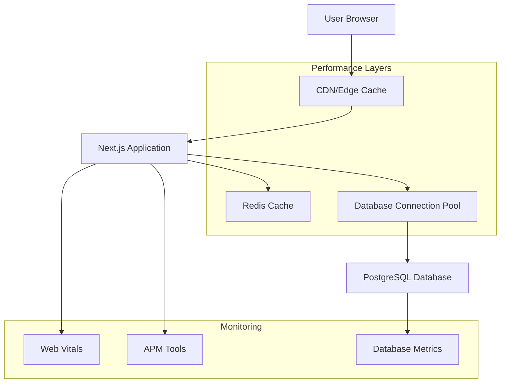

# Performance Guide

This guide covers performance optimization techniques, monitoring strategies, and best practices for the ProdMatic Next.js application.

## Table of Contents

1. [Performance Overview](#performance-overview)
2. [Frontend Performance](#frontend-performance)
3. [Backend Performance](#backend-performance)
4. [Database Optimization](#database-optimization)
5. [Caching Strategies](#caching-strategies)
6. [Monitoring & Metrics](#monitoring--metrics)
7. [Load Testing](#load-testing)
8. [Performance Budgets](#performance-budgets)
9. [Optimization Checklist](#optimization-checklist)
10. [Troubleshooting](#troubleshooting)

## Performance Overview

### Key Performance Indicators (KPIs)

- **Core Web Vitals**
  - Largest Contentful Paint (LCP): < 2.5s
  - First Input Delay (FID): < 100ms
  - Cumulative Layout Shift (CLS): < 0.1

- **Application Metrics**
  - Time to First Byte (TTFB): < 600ms
  - First Contentful Paint (FCP): < 1.8s
  - Time to Interactive (TTI): < 3.8s
  - API Response Time: < 200ms (95th percentile)
  - Database Query Time: < 100ms (95th percentile)

### Performance Architecture



## Frontend Performance

### Next.js Optimization

#### Image Optimization

```tsx
// components/OptimizedImage.tsx
import Image from 'next/image'
import { useState } from 'react'

interface OptimizedImageProps {
  src: string
  alt: string
  width: number
  height: number
  priority?: boolean
  className?: string
}

export function OptimizedImage({
  src,
  alt,
  width,
  height,
  priority = false,
  className
}: OptimizedImageProps) {
  const [isLoading, setIsLoading] = useState(true)

  return (
    <div className={`relative ${className}`}>
      <Image
        src={src}
        alt={alt}
        width={width}
        height={height}
        priority={priority}
        className={`transition-opacity duration-300 ${
          isLoading ? 'opacity-0' : 'opacity-100'
        }`}
        onLoad={() => setIsLoading(false)}
        placeholder="blur"
        blurDataURL="data:image/jpeg;base64,/9j/4AAQSkZJRgABAQAAAQABAAD/2wBDAAYEBQYFBAYGBQYHBwYIChAKCgkJChQODwwQFxQYGBcUFhYaHSUfGhsjHBYWICwgIyYnKSopGR8tMC0oMCUoKSj/2wBDAQcHBwoIChMKChMoGhYaKCgoKCgoKCgoKCgoKCgoKCgoKCgoKCgoKCgoKCgoKCgoKCgoKCgoKCgoKCgoKCgoKCj/wAARCAABAAEDASIAAhEBAxEB/8QAFQABAQAAAAAAAAAAAAAAAAAAAAv/xAAhEAACAQMDBQAAAAAAAAAAAAABAgMABAUGIWGRkqGx0f/EABUBAQEAAAAAAAAAAAAAAAAAAAMF/8QAGhEAAgIDAAAAAAAAAAAAAAAAAAECEgMRkf/aAAwDAQACEQMRAD8AltJagyeH0AthI5xdrLcNM91BF5pX2HaH9bcfaSXWGaRmknyJckliyjqTzSlT54b6bk+h0R//2Q=="
      />
      {isLoading && (
        <div className="absolute inset-0 bg-gray-200 animate-pulse rounded" />
      )}
    </div>
  )
}
```

#### Code Splitting and Lazy Loading

```tsx
// Dynamic imports for heavy components
import dynamic from 'next/dynamic'
import { Suspense } from 'react'

// Lazy load heavy components
const DataVisualization = dynamic(
  () => import('../components/DataVisualization'),
  {
    loading: () => <div className="animate-pulse bg-gray-200 h-64 rounded" />,
    ssr: false // Disable SSR for client-only components
  }
)

const RichTextEditor = dynamic(
  () => import('../components/RichTextEditor'),
  { ssr: false }
)

// Route-based code splitting
const AnalyticsPage = dynamic(() => import('../pages/analytics'))

export function Dashboard() {
  return (
    <div>
      <h1>Dashboard</h1>
      
      <Suspense fallback={<div>Loading visualization...</div>}>
        <DataVisualization />
      </Suspense>
      
      <Suspense fallback={<div>Loading editor...</div>}>
        <RichTextEditor />
      </Suspense>
    </div>
  )
}
```

#### Bundle Analysis

```javascript
// next.config.js
const withBundleAnalyzer = require('@next/bundle-analyzer')({
  enabled: process.env.ANALYZE === 'true',
})

module.exports = withBundleAnalyzer({
  experimental: {
    optimizeCss: true,
    optimizePackageImports: ['lucide-react', '@radix-ui/react-icons']
  },
  
  // Optimize images
  images: {
    formats: ['image/avif', 'image/webp'],
    deviceSizes: [640, 750, 828, 1080, 1200, 1920, 2048, 3840],
    imageSizes: [16, 32, 48, 64, 96, 128, 256, 384],
  },
  
  // Compress responses
  compress: true,
  
  // Optimize fonts
  optimizeFonts: true,
  
  // Tree shaking
  webpack: (config, { dev, isServer }) => {
    if (!dev && !isServer) {
      config.optimization.usedExports = true
      config.optimization.sideEffects = false
    }
    return config
  },
})
```

### React Performance

#### Memoization Strategies

```tsx
// hooks/useOptimizedData.ts
import { useMemo, useCallback } from 'react'
import { debounce } from 'lodash'

export function useOptimizedData(data: any[], searchTerm: string) {
  // Memoize expensive calculations
  const processedData = useMemo(() => {
    return data
      .filter(item => item.status === 'active')
      .sort((a, b) => new Date(b.createdAt).getTime() - new Date(a.createdAt).getTime())
      .map(item => ({
        ...item,
        displayName: `${item.title} (${item.category})`
      }))
  }, [data])

  // Memoize filtered results
  const filteredData = useMemo(() => {
    if (!searchTerm) return processedData
    
    return processedData.filter(item =>
      item.title.toLowerCase().includes(searchTerm.toLowerCase()) ||
      item.description.toLowerCase().includes(searchTerm.toLowerCase())
    )
  }, [processedData, searchTerm])

  // Debounced search callback
  const debouncedSearch = useCallback(
    debounce((term: string, callback: (results: any[]) => void) => {
      const results = processedData.filter(item =>
        item.title.toLowerCase().includes(term.toLowerCase())
      )
      callback(results)
    }, 300),
    [processedData]
  )

  return { filteredData, debouncedSearch }
}
```

#### Virtual Scrolling

```tsx
// components/VirtualizedList.tsx
import { FixedSizeList as List } from 'react-window'
import { memo } from 'react'

interface VirtualizedListProps {
  items: any[]
  height: number
  itemHeight: number
  renderItem: (props: any) => JSX.Element
}

const VirtualizedList = memo(function VirtualizedList({
  items,
  height,
  itemHeight,
  renderItem
}: VirtualizedListProps) {
  const Row = ({ index, style }: { index: number; style: any }) => (
    <div style={style}>
      {renderItem({ item: items[index], index })}
    </div>
  )

  return (
    <List
      height={height}
      itemCount={items.length}
      itemSize={itemHeight}
      overscanCount={5}
    >
      {Row}
    </List>
  )
})

export default VirtualizedList
```

## Backend Performance

### Server Actions Optimization

```typescript
// lib/performance/cache.ts
import { unstable_cache } from 'next/cache'
import { Redis } from 'ioredis'

const redis = new Redis(process.env.REDIS_URL!)

// Cache expensive operations
export const getCachedData = unstable_cache(
  async (key: string) => {
    // Expensive operation
    const data = await performExpensiveOperation(key)
    return data
  },
  ['expensive-operation'],
  {
    revalidate: 3600, // 1 hour
    tags: ['data']
  }
)

// Redis caching utility
export async function withCache<T>(
  key: string,
  fetcher: () => Promise<T>,
  ttl: number = 3600
): Promise<T> {
  try {
    const cached = await redis.get(key)
    if (cached) {
      return JSON.parse(cached)
    }
  } catch (error) {
    console.warn('Cache read error:', error)
  }

  const data = await fetcher()
  
  try {
    await redis.setex(key, ttl, JSON.stringify(data))
  } catch (error) {
    console.warn('Cache write error:', error)
  }

  return data
}
```

### API Route Optimization

```typescript
// app/api/ideas/route.ts
import { NextRequest, NextResponse } from 'next/server'
import { rateLimit } from '@/lib/rate-limit'
import { withCache } from '@/lib/performance/cache'
import { z } from 'zod'

const querySchema = z.object({
  page: z.coerce.number().min(1).default(1),
  limit: z.coerce.number().min(1).max(100).default(20),
  search: z.string().optional(),
  category: z.string().optional(),
})

export async function GET(request: NextRequest) {
  try {
    // Rate limiting
    const rateLimitResult = await rateLimit(request)
    if (!rateLimitResult.success) {
      return NextResponse.json(
        { error: 'Too many requests' },
        { status: 429 }
      )
    }

    // Validate query parameters
    const url = new URL(request.url)
    const query = querySchema.parse({
      page: url.searchParams.get('page'),
      limit: url.searchParams.get('limit'),
      search: url.searchParams.get('search'),
      category: url.searchParams.get('category'),
    })

    // Generate cache key
    const cacheKey = `ideas:${JSON.stringify(query)}`

    // Use cached data if available
    const data = await withCache(
      cacheKey,
      async () => {
        const ideas = await prisma.idea.findMany({
          where: {
            ...(query.search && {
              OR: [
                { title: { contains: query.search, mode: 'insensitive' } },
                { description: { contains: query.search, mode: 'insensitive' } }
              ]
            }),
            ...(query.category && { category: query.category })
          },
          include: {
            author: { select: { id: true, name: true, image: true } },
            _count: { select: { votes: true, comments: true } }
          },
          orderBy: { createdAt: 'desc' },
          skip: (query.page - 1) * query.limit,
          take: query.limit,
        })

        const total = await prisma.idea.count({
          where: {
            ...(query.search && {
              OR: [
                { title: { contains: query.search, mode: 'insensitive' } },
                { description: { contains: query.search, mode: 'insensitive' } }
              ]
            }),
            ...(query.category && { category: query.category })
          }
        })

        return { ideas, total, page: query.page, limit: query.limit }
      },
      300 // 5 minutes cache
    )

    return NextResponse.json(data)
  } catch (error) {
    console.error('API Error:', error)
    return NextResponse.json(
      { error: 'Internal server error' },
      { status: 500 }
    )
  }
}
```

## Database Optimization

### Query Optimization

```typescript
// lib/database/optimized-queries.ts
import { prisma } from '@/lib/prisma'

// Optimized query with proper indexing
export async function getIdeasWithMetrics(organizationId: string) {
  return await prisma.idea.findMany({
    where: { organizationId },
    select: {
      id: true,
      title: true,
      description: true,
      status: true,
      createdAt: true,
      author: {
        select: {
          id: true,
          name: true,
          image: true
        }
      },
      _count: {
        select: {
          votes: true,
          comments: true,
          features: true
        }
      },
      votes: {
        select: {
          type: true
        }
      }
    },
    orderBy: [
      { status: 'asc' },
      { createdAt: 'desc' }
    ]
  })
}

// Batch operations for better performance
export async function batchUpdateIdeas(
  updates: Array<{ id: string; status: string }>
) {
  const updatePromises = updates.map(({ id, status }) =>
    prisma.idea.update({
      where: { id },
      data: { status }
    })
  )

  return await prisma.$transaction(updatePromises)
}

// Aggregation queries
export async function getOrganizationMetrics(organizationId: string) {
  const [ideas, features, releases] = await Promise.all([
    prisma.idea.groupBy({
      by: ['status'],
      where: { organizationId },
      _count: { id: true }
    }),
    prisma.feature.groupBy({
      by: ['status'],
      where: { product: { organizationId } },
      _count: { id: true }
    }),
    prisma.release.count({
      where: {
        product: { organizationId },
        releasedAt: {
          gte: new Date(Date.now() - 30 * 24 * 60 * 60 * 1000) // Last 30 days
        }
      }
    })
  ])

  return { ideas, features, releases }
}
```

### Database Indexing

```sql
-- Performance indexes for common queries

-- Ideas table indexes
CREATE INDEX CONCURRENTLY idx_ideas_organization_status 
ON "Idea" ("organizationId", "status");

CREATE INDEX CONCURRENTLY idx_ideas_created_at 
ON "Idea" ("createdAt" DESC);

CREATE INDEX CONCURRENTLY idx_ideas_search 
ON "Idea" USING gin(to_tsvector('english', "title" || ' ' || "description"));

-- Features table indexes
CREATE INDEX CONCURRENTLY idx_features_product_status 
ON "Feature" ("productId", "status");

CREATE INDEX CONCURRENTLY idx_features_assignee 
ON "Feature" ("assigneeId") WHERE "assigneeId" IS NOT NULL;

-- Votes table indexes
CREATE INDEX CONCURRENTLY idx_votes_idea_type 
ON "Vote" ("ideaId", "type");

CREATE INDEX CONCURRENTLY idx_votes_user_idea 
ON "Vote" ("userId", "ideaId");

-- Comments table indexes
CREATE INDEX CONCURRENTLY idx_comments_idea_created 
ON "Comment" ("ideaId", "createdAt" DESC);

-- Audit logs indexes
CREATE INDEX CONCURRENTLY idx_audit_logs_organization_action 
ON "AuditLog" ("organizationId", "action");

CREATE INDEX CONCURRENTLY idx_audit_logs_created_at 
ON "AuditLog" ("createdAt" DESC);

-- Partial indexes for active records
CREATE INDEX CONCURRENTLY idx_active_ideas 
ON "Idea" ("organizationId", "createdAt" DESC) 
WHERE "status" != 'ARCHIVED';

CREATE INDEX CONCURRENTLY idx_active_features 
ON "Feature" ("productId", "priority") 
WHERE "status" IN ('TODO', 'IN_PROGRESS');
```

### Connection Pooling

```typescript
// lib/database/connection.ts
import { PrismaClient } from '@prisma/client'

const globalForPrisma = globalThis as unknown as {
  prisma: PrismaClient | undefined
}

export const prisma = globalForPrisma.prisma ??
  new PrismaClient({
    log: process.env.NODE_ENV === 'development' ? ['query', 'error', 'warn'] : ['error'],
    datasources: {
      db: {
        url: process.env.DATABASE_URL
      }
    },
    // Connection pooling configuration
    __internal: {
      engine: {
        connection_limit: 10,
        pool_timeout: 10,
        schema_cache_size: 100
      }
    }
  })

if (process.env.NODE_ENV !== 'production') globalForPrisma.prisma = prisma

// Connection health check
export async function checkDatabaseHealth() {
  try {
    await prisma.$queryRaw`SELECT 1`
    return { status: 'healthy', timestamp: new Date().toISOString() }
  } catch (error) {
    return { 
      status: 'unhealthy', 
      error: error instanceof Error ? error.message : 'Unknown error',
      timestamp: new Date().toISOString() 
    }
  }
}
```

## Caching Strategies

### Multi-Level Caching

```typescript
// lib/cache/strategy.ts
import { Redis } from 'ioredis'
import { LRUCache } from 'lru-cache'

// L1 Cache: In-memory (fastest)
const memoryCache = new LRUCache<string, any>({
  max: 1000,
  ttl: 1000 * 60 * 5, // 5 minutes
})

// L2 Cache: Redis (shared across instances)
const redis = new Redis(process.env.REDIS_URL!)

// L3 Cache: Database (slowest but most reliable)
export class CacheStrategy {
  async get<T>(key: string): Promise<T | null> {
    // Try L1 cache first
    const memoryResult = memoryCache.get(key)
    if (memoryResult) {
      return memoryResult as T
    }

    // Try L2 cache
    try {
      const redisResult = await redis.get(key)
      if (redisResult) {
        const parsed = JSON.parse(redisResult) as T
        // Populate L1 cache
        memoryCache.set(key, parsed)
        return parsed
      }
    } catch (error) {
      console.warn('Redis cache error:', error)
    }

    return null
  }

  async set<T>(key: string, value: T, ttl: number = 3600): Promise<void> {
    // Set in L1 cache
    memoryCache.set(key, value)

    // Set in L2 cache
    try {
      await redis.setex(key, ttl, JSON.stringify(value))
    } catch (error) {
      console.warn('Redis cache set error:', error)
    }
  }

  async invalidate(pattern: string): Promise<void> {
    // Clear L1 cache
    memoryCache.clear()

    // Clear L2 cache
    try {
      const keys = await redis.keys(pattern)
      if (keys.length > 0) {
        await redis.del(...keys)
      }
    } catch (error) {
      console.warn('Redis cache invalidation error:', error)
    }
  }
}

export const cache = new CacheStrategy()
```

### Cache Invalidation

```typescript
// lib/cache/invalidation.ts
import { cache } from './strategy'

export class CacheInvalidator {
  // Invalidate related caches when data changes
  async invalidateIdea(ideaId: string, organizationId: string) {
    await Promise.all([
      cache.invalidate(`idea:${ideaId}:*`),
      cache.invalidate(`ideas:${organizationId}:*`),
      cache.invalidate(`metrics:${organizationId}:*`),
      cache.invalidate(`dashboard:${organizationId}:*`)
    ])
  }

  async invalidateProduct(productId: string, organizationId: string) {
    await Promise.all([
      cache.invalidate(`product:${productId}:*`),
      cache.invalidate(`products:${organizationId}:*`),
      cache.invalidate(`features:${productId}:*`),
      cache.invalidate(`releases:${productId}:*`)
    ])
  }

  async invalidateUser(userId: string) {
    await Promise.all([
      cache.invalidate(`user:${userId}:*`),
      cache.invalidate(`notifications:${userId}:*`),
      cache.invalidate(`dashboard:*:${userId}`)
    ])
  }
}

export const cacheInvalidator = new CacheInvalidator()
```

## Monitoring & Metrics

### Performance Monitoring Setup

```typescript
// lib/monitoring/performance.ts
import { performance } from 'perf_hooks'

export class PerformanceMonitor {
  private metrics: Map<string, number[]> = new Map()

  startTimer(label: string): () => number {
    const start = performance.now()
    
    return () => {
      const duration = performance.now() - start
      this.recordMetric(label, duration)
      return duration
    }
  }

  recordMetric(label: string, value: number) {
    if (!this.metrics.has(label)) {
      this.metrics.set(label, [])
    }
    
    const values = this.metrics.get(label)!
    values.push(value)
    
    // Keep only last 1000 measurements
    if (values.length > 1000) {
      values.shift()
    }
  }

  getMetrics(label: string) {
    const values = this.metrics.get(label) || []
    if (values.length === 0) return null

    const sorted = [...values].sort((a, b) => a - b)
    return {
      count: values.length,
      min: sorted[0],
      max: sorted[sorted.length - 1],
      avg: values.reduce((a, b) => a + b, 0) / values.length,
      p50: sorted[Math.floor(sorted.length * 0.5)],
      p95: sorted[Math.floor(sorted.length * 0.95)],
      p99: sorted[Math.floor(sorted.length * 0.99)]
    }
  }

  getAllMetrics() {
    const result: Record<string, any> = {}
    for (const [label] of this.metrics) {
      result[label] = this.getMetrics(label)
    }
    return result
  }
}

export const performanceMonitor = new PerformanceMonitor()

// Middleware for API routes
export function withPerformanceMonitoring<T extends any[], R>(
  fn: (...args: T) => Promise<R>,
  label: string
) {
  return async (...args: T): Promise<R> => {
    const endTimer = performanceMonitor.startTimer(label)
    try {
      const result = await fn(...args)
      return result
    } finally {
      endTimer()
    }
  }
}
```

### Web Vitals Tracking

```typescript
// lib/monitoring/web-vitals.ts
import { getCLS, getFID, getFCP, getLCP, getTTFB } from 'web-vitals'

interface WebVitalMetric {
  name: string
  value: number
  rating: 'good' | 'needs-improvement' | 'poor'
  delta: number
  id: string
}

export function trackWebVitals() {
  function sendToAnalytics(metric: WebVitalMetric) {
    // Send to your analytics service
    if (typeof window !== 'undefined' && window.gtag) {
      window.gtag('event', metric.name, {
        event_category: 'Web Vitals',
        event_label: metric.id,
        value: Math.round(metric.name === 'CLS' ? metric.value * 1000 : metric.value),
        custom_map: {
          metric_rating: metric.rating
        }
      })
    }

    // Also send to your custom analytics
    fetch('/api/analytics/web-vitals', {
      method: 'POST',
      headers: { 'Content-Type': 'application/json' },
      body: JSON.stringify({
        name: metric.name,
        value: metric.value,
        rating: metric.rating,
        url: window.location.href,
        timestamp: Date.now()
      })
    }).catch(console.error)
  }

  getCLS(sendToAnalytics)
  getFID(sendToAnalytics)
  getFCP(sendToAnalytics)
  getLCP(sendToAnalytics)
  getTTFB(sendToAnalytics)
}
```

### Custom Metrics Dashboard

```typescript
// app/admin/performance/page.tsx
import { performanceMonitor } from '@/lib/monitoring/performance'
import { checkDatabaseHealth } from '@/lib/database/connection'

export default async function PerformanceDashboard() {
  const metrics = performanceMonitor.getAllMetrics()
  const dbHealth = await checkDatabaseHealth()

  return (
    <div className="p-6">
      <h1 className="text-2xl font-bold mb-6">Performance Dashboard</h1>
      
      <div className="grid grid-cols-1 md:grid-cols-2 lg:grid-cols-3 gap-6">
        {/* Database Health */}
        <div className="bg-white p-4 rounded-lg shadow">
          <h2 className="text-lg font-semibold mb-2">Database Health</h2>
          <div className={`text-sm ${
            dbHealth.status === 'healthy' ? 'text-green-600' : 'text-red-600'
          }`}>
            Status: {dbHealth.status}
          </div>
          <div className="text-xs text-gray-500">
            Last checked: {dbHealth.timestamp}
          </div>
        </div>

        {/* API Performance */}
        {Object.entries(metrics).map(([label, data]) => (
          <div key={label} className="bg-white p-4 rounded-lg shadow">
            <h2 className="text-lg font-semibold mb-2">{label}</h2>
            {data && (
              <div className="space-y-1 text-sm">
                <div>Count: {data.count}</div>
                <div>Avg: {data.avg.toFixed(2)}ms</div>
                <div>P95: {data.p95.toFixed(2)}ms</div>
                <div>P99: {data.p99.toFixed(2)}ms</div>
              </div>
            )}
          </div>
        ))}
      </div>
    </div>
  )
}
```

## Load Testing

### K6 Load Testing Scripts

```javascript
// scripts/load-test.js
import http from 'k6/http'
import { check, sleep } from 'k6'
import { Rate } from 'k6/metrics'

const errorRate = new Rate('errors')

export const options = {
  stages: [
    { duration: '2m', target: 10 }, // Ramp up
    { duration: '5m', target: 50 }, // Stay at 50 users
    { duration: '2m', target: 100 }, // Ramp up to 100
    { duration: '5m', target: 100 }, // Stay at 100
    { duration: '2m', target: 0 }, // Ramp down
  ],
  thresholds: {
    http_req_duration: ['p(95)<500'], // 95% of requests under 500ms
    http_req_failed: ['rate<0.1'], // Error rate under 10%
    errors: ['rate<0.1'],
  },
}

const BASE_URL = 'http://localhost:3000'

export default function () {
  // Test homepage
  let response = http.get(`${BASE_URL}/`)
  check(response, {
    'homepage status is 200': (r) => r.status === 200,
    'homepage loads in <2s': (r) => r.timings.duration < 2000,
  }) || errorRate.add(1)

  sleep(1)

  // Test API endpoint
  response = http.get(`${BASE_URL}/api/ideas?page=1&limit=20`)
  check(response, {
    'API status is 200': (r) => r.status === 200,
    'API responds in <500ms': (r) => r.timings.duration < 500,
    'API returns valid JSON': (r) => {
      try {
        JSON.parse(r.body)
        return true
      } catch {
        return false
      }
    },
  }) || errorRate.add(1)

  sleep(2)

  // Test search functionality
  response = http.get(`${BASE_URL}/api/ideas?search=test&page=1&limit=10`)
  check(response, {
    'Search API status is 200': (r) => r.status === 200,
    'Search responds in <800ms': (r) => r.timings.duration < 800,
  }) || errorRate.add(1)

  sleep(1)
}
```

### Artillery Load Testing

```yaml
# artillery-config.yml
config:
  target: 'http://localhost:3000'
  phases:
    - duration: 60
      arrivalRate: 5
      name: "Warm up"
    - duration: 120
      arrivalRate: 10
      name: "Ramp up load"
    - duration: 300
      arrivalRate: 20
      name: "Sustained load"
  payload:
    path: "test-data.csv"
    fields:
      - "userId"
      - "productId"
      - "ideaTitle"

scenarios:
  - name: "Browse and search"
    weight: 60
    flow:
      - get:
          url: "/"
      - think: 2
      - get:
          url: "/api/ideas?page=1&limit=20"
      - think: 3
      - get:
          url: "/api/ideas?search={{ ideaTitle }}&page=1&limit=10"

  - name: "Create idea"
    weight: 30
    flow:
      - post:
          url: "/api/ideas"
          json:
            title: "{{ ideaTitle }}"
            description: "Test idea description"
            productId: "{{ productId }}"
            impact: 5
            effort: 3
            confidence: 4

  - name: "View dashboard"
    weight: 10
    flow:
      - get:
          url: "/dashboard"
      - think: 5
      - get:
          url: "/api/metrics/{{ userId }}"
```

## Performance Budgets

### Bundle Size Budgets

```javascript
// performance-budget.config.js
module.exports = {
  budgets: [
    {
      path: '/',
      resourceSizes: [
        {
          resourceType: 'script',
          maximumSizeInBytes: 300000 // 300KB
        },
        {
          resourceType: 'total',
          maximumSizeInBytes: 1000000 // 1MB
        }
      ],
      resourceCounts: [
        {
          resourceType: 'script',
          maximumResourceCount: 10
        }
      ]
    },
    {
      path: '/dashboard',
      resourceSizes: [
        {
          resourceType: 'script',
          maximumSizeInBytes: 500000 // 500KB (dashboard can be larger)
        }
      ]
    }
  ]
}
```

### Performance CI/CD Integration

```yaml
# .github/workflows/performance.yml
name: Performance Tests

on:
  pull_request:
    branches: [main]
  push:
    branches: [main]

jobs:
  lighthouse:
    runs-on: ubuntu-latest
    steps:
      - uses: actions/checkout@v3
      
      - name: Setup Node.js
        uses: actions/setup-node@v3
        with:
          node-version: '18'
          cache: 'npm'
      
      - name: Install dependencies
        run: npm ci
      
      - name: Build application
        run: npm run build
      
      - name: Start application
        run: npm start &
        
      - name: Wait for app to be ready
        run: npx wait-on http://localhost:3000
      
      - name: Run Lighthouse CI
        run: |
          npm install -g @lhci/cli@0.12.x
          lhci autorun
        env:
          LHCI_GITHUB_APP_TOKEN: ${{ secrets.LHCI_GITHUB_APP_TOKEN }}
  
  bundle-analysis:
    runs-on: ubuntu-latest
    steps:
      - uses: actions/checkout@v3
      
      - name: Setup Node.js
        uses: actions/setup-node@v3
        with:
          node-version: '18'
          cache: 'npm'
      
      - name: Install dependencies
        run: npm ci
      
      - name: Analyze bundle
        run: |
          npm run build
          npx bundlesize
        env:
          BUNDLESIZE_GITHUB_TOKEN: ${{ secrets.GITHUB_TOKEN }}
```

## Optimization Checklist

### Frontend Optimization

- [ ] **Images**
  - [ ] Use Next.js Image component
  - [ ] Implement lazy loading
  - [ ] Use modern formats (WebP, AVIF)
  - [ ] Optimize image sizes for different devices
  - [ ] Add blur placeholders

- [ ] **JavaScript**
  - [ ] Code splitting implemented
  - [ ] Dynamic imports for heavy components
  - [ ] Tree shaking enabled
  - [ ] Bundle size under budget
  - [ ] Remove unused dependencies

- [ ] **CSS**
  - [ ] Critical CSS inlined
  - [ ] Unused CSS removed
  - [ ] CSS minification enabled
  - [ ] Use CSS-in-JS efficiently

- [ ] **Fonts**
  - [ ] Font optimization enabled
  - [ ] Preload critical fonts
  - [ ] Use font-display: swap
  - [ ] Minimize font variations

### Backend Optimization

- [ ] **API Performance**
  - [ ] Response times under 200ms
  - [ ] Proper error handling
  - [ ] Rate limiting implemented
  - [ ] Request validation
  - [ ] Compression enabled

- [ ] **Database**
  - [ ] Proper indexing
  - [ ] Query optimization
  - [ ] Connection pooling
  - [ ] Avoid N+1 queries
  - [ ] Use database transactions

- [ ] **Caching**
  - [ ] Multi-level caching strategy
  - [ ] Cache invalidation logic
  - [ ] CDN configuration
  - [ ] Browser caching headers

### Monitoring

- [ ] **Metrics Collection**
  - [ ] Web Vitals tracking
  - [ ] Custom performance metrics
  - [ ] Error monitoring
  - [ ] User experience metrics

- [ ] **Alerting**
  - [ ] Performance degradation alerts
  - [ ] Error rate alerts
  - [ ] Resource usage alerts
  - [ ] Uptime monitoring

## Troubleshooting

### Common Performance Issues

#### Slow Page Load Times

```typescript
// Debug slow page loads
export function debugPageLoad() {
  if (typeof window !== 'undefined') {
    // Measure navigation timing
    const navigation = performance.getEntriesByType('navigation')[0] as PerformanceNavigationTiming
    
    console.log('Navigation Timing:', {
      'DNS Lookup': navigation.domainLookupEnd - navigation.domainLookupStart,
      'TCP Connection': navigation.connectEnd - navigation.connectStart,
      'TLS Handshake': navigation.secureConnectionStart > 0 
        ? navigation.connectEnd - navigation.secureConnectionStart : 0,
      'Request': navigation.responseStart - navigation.requestStart,
      'Response': navigation.responseEnd - navigation.responseStart,
      'DOM Processing': navigation.domComplete - navigation.responseEnd,
      'Total': navigation.loadEventEnd - navigation.navigationStart
    })
    
    // Measure resource loading
    const resources = performance.getEntriesByType('resource')
    const slowResources = resources
      .filter(resource => resource.duration > 1000)
      .sort((a, b) => b.duration - a.duration)
    
    console.log('Slow Resources (>1s):', slowResources)
  }
}
```

#### High Memory Usage

```typescript
// Monitor memory usage
export function monitorMemoryUsage() {
  if (typeof window !== 'undefined' && 'memory' in performance) {
    const memory = (performance as any).memory
    
    console.log('Memory Usage:', {
      'Used': `${(memory.usedJSHeapSize / 1024 / 1024).toFixed(2)} MB`,
      'Total': `${(memory.totalJSHeapSize / 1024 / 1024).toFixed(2)} MB`,
      'Limit': `${(memory.jsHeapSizeLimit / 1024 / 1024).toFixed(2)} MB`
    })
    
    // Alert if memory usage is high
    const usagePercent = (memory.usedJSHeapSize / memory.jsHeapSizeLimit) * 100
    if (usagePercent > 80) {
      console.warn(`High memory usage: ${usagePercent.toFixed(1)}%`)
    }
  }
}
```

#### Database Query Performance

```typescript
// Debug slow database queries
export function debugSlowQueries() {
  const originalQuery = prisma.$queryRaw
  
  prisma.$queryRaw = new Proxy(originalQuery, {
    apply: async (target, thisArg, args) => {
      const start = performance.now()
      const result = await target.apply(thisArg, args)
      const duration = performance.now() - start
      
      if (duration > 100) { // Log queries slower than 100ms
        console.warn(`Slow query (${duration.toFixed(2)}ms):`, args[0])
      }
      
      return result
    }
  })
}
```

### Performance Testing Commands

```bash
# Bundle analysis
npm run build
npm run analyze

# Lighthouse audit
npx lighthouse http://localhost:3000 --output=html --output-path=./lighthouse-report.html

# Load testing with K6
k6 run scripts/load-test.js

# Load testing with Artillery
artillery run artillery-config.yml

# Memory leak detection
node --inspect --max-old-space-size=4096 scripts/memory-test.js

# CPU profiling
node --prof app.js
node --prof-process isolate-*.log > processed.txt
```

---

This performance guide provides comprehensive strategies for optimizing the ProdMatic application. Regular monitoring and testing are essential for maintaining optimal performance as the application scales.

**Remember**: Performance optimization is an ongoing process. Continuously monitor, measure, and improve based on real user data and changing requirements.