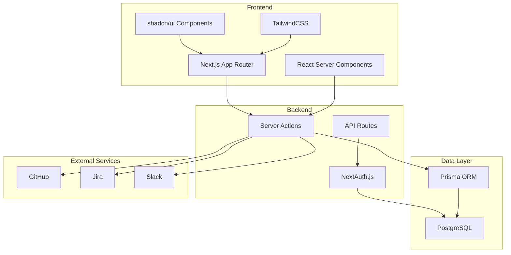
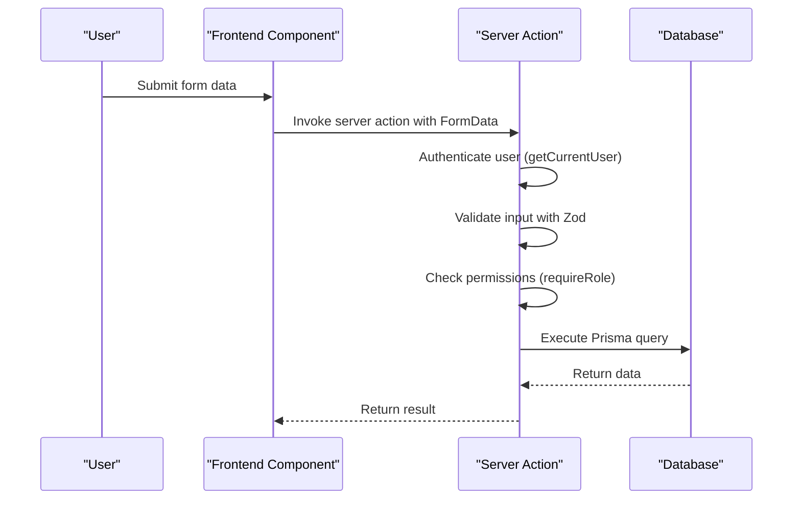
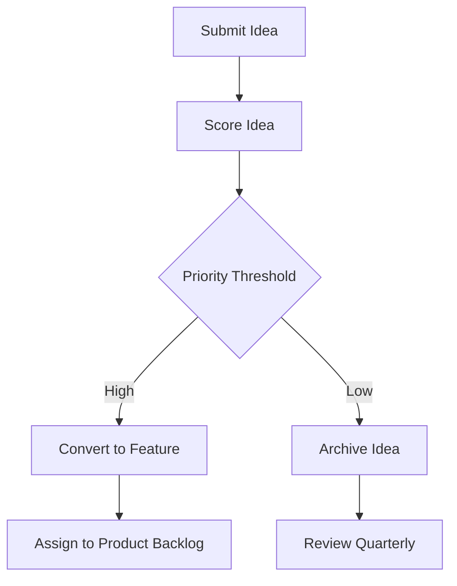
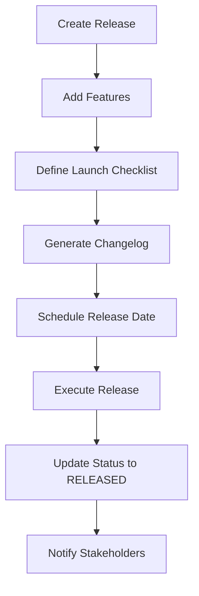
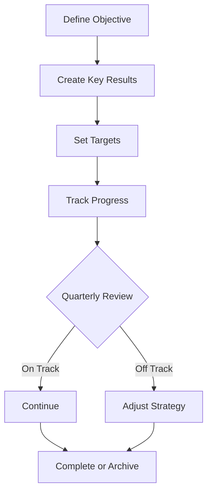
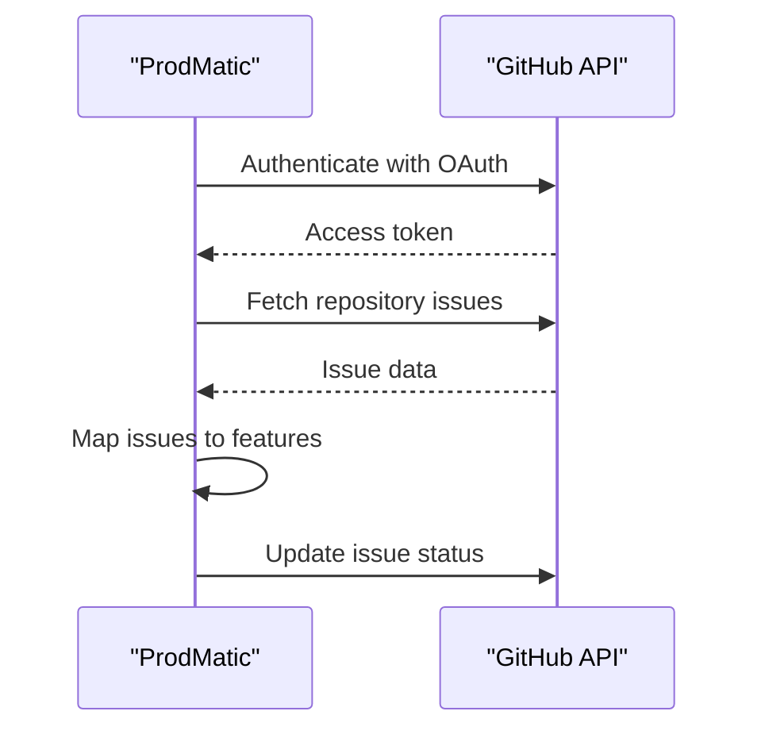
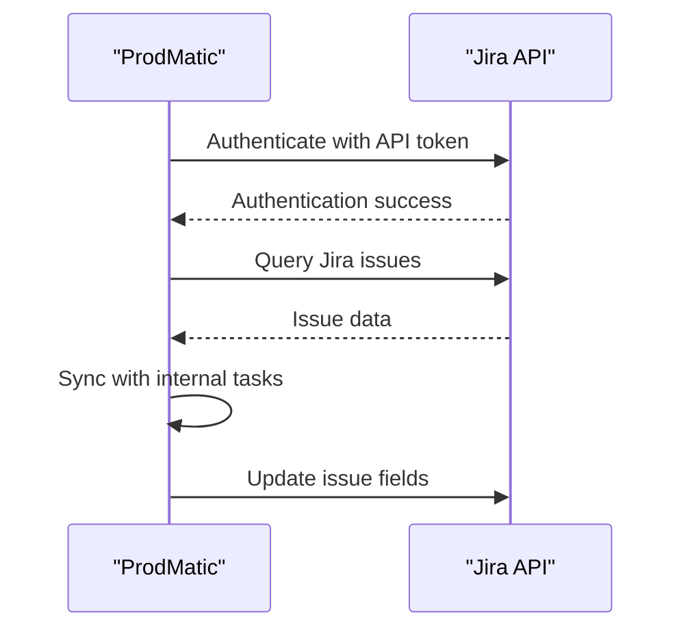
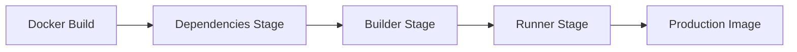
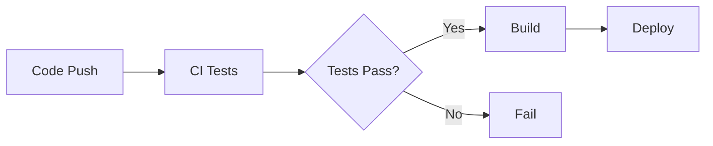

# ProdMatic System Architecture

This document provides a comprehensive overview of the ProdMatic system architecture, including technical decisions, patterns, and component interactions.

## Table of Contents
1. [Overview](#overview)
2. [Core Architecture](#core-architecture)
3. [Frontend Structure](#frontend-structure)
4. [Backend Services](#backend-services)
5. [Database and Data Model](#database-and-data-model)
6. [Key Workflows](#key-workflows)
7. [Integration Points](#integration-points)
8. [Deployment Model](#deployment-model)
9. [Security Model](#security-model)
10. [Performance Considerations](#performance-considerations)

## Overview

ProdMatic is a full-stack product lifecycle management platform built on modern web technologies. The system enables product managers to manage products from ideation through to sunset with comprehensive tooling for each phase of the product lifecycle.

The architecture follows a Next.js App Router pattern with React Server Components, leveraging server actions for data mutations and Prisma ORM for database interactions. The application implements a multi-tenant design with organization-level data isolation, supporting multiple teams and role-based access control.

## Core Architecture



### Key Technical Decisions

1. **Next.js 14** for server-side rendering and API routes
2. **TypeScript** for type safety
3. **TailwindCSS + shadcn/ui** for styling
4. **PostgreSQL** with **Prisma ORM** for data persistence
5. **NextAuth.js** for authentication
6. **React Server Components** for performance
7. **TanStack Query** for client-side state management
8. **Multi-stage Docker build** for optimized image size and security

### Architecture Patterns and Design Patterns

1. **Multi-stage Docker Build** for optimized image size
2. **Server Components** for performance and SEO
3. **React Server Actions** for server-side logic
4. **Repository Pattern** in server actions for data access
5. **Adapter Pattern** with `@auth/prisma-adapter`
6. **Command Pattern** for changelog management
7. **Strategy Pattern** for authentication providers

## Frontend Structure

The frontend is organized using the Next.js App Router directory structure, with dynamic routing based on organization slug (orgSlug) and product key (productKey). This routing pattern enables multi-tenancy and product-specific contexts throughout the application.

The UI components are built using shadcn/ui primitives with TailwindCSS for styling, providing a consistent design system across the application. React Server Components enable efficient data loading and server-side rendering, while client components handle interactive elements.

Key frontend directories include:
- `app/`: Next.js App Router pages with route handlers
- `components/`: Reusable UI components and shadcn/ui implementations
- `lib/`: Utility functions, authentication helpers, and configuration
- `types/`: TypeScript type definitions and NextAuth extensions

```mermaid
graph TB
A[app/] --> B[api/]
A --> C[auth/]
A --> D[orgs/[orgSlug]/]
D --> E[products/[productKey]/]
E --> F[backlog]
E --> G[roadmap]
E --> H[releases]
E --> I[analytics]
E --> J[settings]
A --> K[globals.css]
A --> L[layout.tsx]
M[components/] --> N[ui/]
N --> O[button.tsx]
N --> P[card.tsx]
N --> Q[data-table.tsx]
M --> R[app-shell.tsx]
M --> S[auth-provider.tsx]
```

## Backend Services

The backend services are implemented primarily through server actions and API routes, with business logic encapsulated in the `src/server/actions` directory. Each action corresponds to a specific domain entity such as products, ideas, releases, or OKRs.

Server actions provide a secure way to perform data mutations on the server, with automatic protection against cross-site request forgery (CSRF) attacks. These actions handle authentication, authorization, input validation, database operations, and activity logging.

Authentication is managed through NextAuth.js with multiple providers including credentials, Google, and GitHub. The authentication flow is configured in `src/lib/auth.ts` with JWT-based sessions and Prisma adapter for persistent storage.



## Database and Data Model

The database schema is defined using Prisma ORM with a comprehensive data model that supports the full product lifecycle. The schema includes 25+ interconnected entities with proper relationships and constraints.

The multi-tenant architecture is implemented through organization-level data isolation, where all entities are associated with an organization and access is controlled based on user memberships. The schema supports soft deletion with `deletedAt` fields for data preservation.

Key entities in the data model include:
- **Organization**: Top-level tenant with teams and products
- **Product**: Core entity representing a product with lifecycle state
- **Idea**: Product ideas that can be converted to features
- **Feature**: Implemented product capabilities
- **Release**: Product releases with changelogs
- **OKR**: Objectives and Key Results for goal tracking

```mermaid
erDiagram
ORGANIZATION ||--o{ PRODUCT : contains
ORGANIZATION ||--o{ TEAM : has
ORGANIZATION ||--o{ USER : members
PRODUCT ||--o{ IDEA : contains
PRODUCT ||--o{ FEATURE : contains
PRODUCT ||--o{ RELEASE : has
PRODUCT ||--o{ OKR : has
PRODUCT ||--o{ DOCUMENT : has
IDEA ||--o{ FEATURE : converts to
RELEASE ||--o{ CHANGELOG : includes
OKR ||--o{ KEY_RESULT : has
USER ||--o{ MEMBERSHIP : has
TEAM ||--o{ MEMBERSHIP : has
ORGANIZATION {
string id PK
string name
string slug UK
datetime createdAt
datetime updatedAt
}
PRODUCT {
string id PK
string name
string key UK
string lifecycle
string organizationId FK
datetime createdAt
datetime updatedAt
}
IDEA {
string id PK
string title
string description
int priority
string status
string productId FK
string creatorId FK
datetime createdAt
datetime updatedAt
}
FEATURE {
string id PK
string title
string description
string status
string productId FK
string epicId FK
datetime createdAt
datetime updatedAt
}
RELEASE {
string id PK
string name
string version
string status
datetime releaseDate
string productId FK
datetime createdAt
datetime updatedAt
}
OKR {
string id PK
string objective
float progress
string status
string productId FK
string ownerId FK
datetime createdAt
datetime updatedAt
}
```

## Key Workflows

### Idea Management Workflow
The idea management workflow enables users to capture, prioritize, and convert product ideas into actionable features.



### Release Planning Workflow
The release management workflow guides users through planning, executing, and documenting product releases.



### OKR Tracking Workflow
The OKR (Objectives and Key Results) workflow enables goal setting and progress tracking for product teams.



## Integration Points

ProdMatic integrates with external tools through dedicated server actions and API endpoints. The integration system is designed to synchronize data between ProdMatic and third-party services.

### GitHub Integration
The GitHub integration enables synchronization of feature development status with GitHub repositories, including pull requests and issues.



### Jira Integration
The Jira integration connects ProdMatic with Jira projects to synchronize backlog items, sprints, and task statuses.



## Deployment Model

The deployment model is designed for flexibility and scalability, supporting multiple deployment options including Vercel, Docker, and cloud providers.

### Docker Deployment
The Docker deployment uses a multi-stage build process with separate containers for the application, database, Redis, and Nginx reverse proxy.



### CI/CD Pipeline
The CI/CD pipeline automates testing, building, and deployment with GitHub Actions.



## Security Model

The security model implements multiple layers of protection to ensure data integrity and user privacy.

### Authentication
- NextAuth.js with multiple providers (credentials, Google, GitHub)
- JWT-based sessions with secure secrets
- Role-based access control (RBAC)

### Authorization
- Organization-level data isolation
- Team-based permissions
- Feature-level access control

### Data Protection
- Environment variable encryption
- HTTPS enforcement
- Secure password hashing with bcrypt
- Input validation with Zod

## Performance Considerations

### Frontend Optimization
- React Server Components for server-side rendering
- Code splitting and lazy loading
- Image optimization with Next.js Image component
- Bundle size optimization

### Backend Optimization
- Database indexing for common queries
- Connection pooling for database connections
- Caching strategies with Redis
- API response optimization

### Database Optimization
- Proper indexing on frequently queried fields
- Query optimization with Prisma
- Connection pooling
- Regular maintenance and vacuuming

---

*This architecture document is maintained as part of the ProdMatic project and should be updated as the system evolves.*